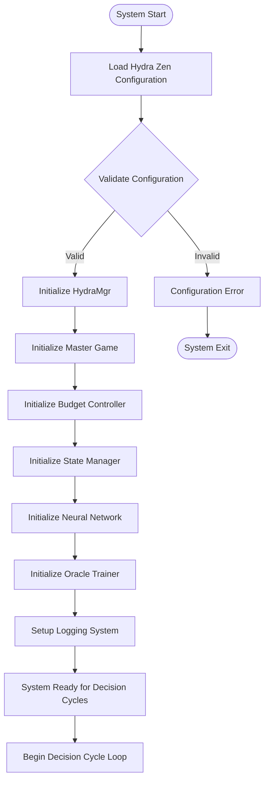

# Design Document: AI Hydra

## Overview

The AI Hydra implements a sophisticated budget-constrained tree search algorithm for Snake Game AI decision making with complete headless operation capability. The system uses Hydra Zen for configuration management and provides both direct execution and ZeroMQ-based message communication for remote control and monitoring.

The core innovation is a dynamic tree search that explores all possible move combinations until either natural termination (collision) or budget exhaustion, then selects the optimal path based on cumulative rewards. This approach provides superior decision making compared to single-step lookahead while maintaining predictable computational costs.

**Key Architecture Features:**
- **100% Headless Operation**: AI agent runs completely without GUI, controlled via ZeroMQ messages
- **Hybrid Neural Network + Tree Search**: Combines NN speed with tree search reliability
- **Message-Based Communication**: Complete separation of AI logic and presentation layer
- **Real-time Monitoring**: Live status updates and performance metrics via ZeroMQ
- **Deterministic Reproducibility**: All operations use controlled seeds for consistent results

## Architecture

### High-Level Architecture


### Communication Architecture


## Decision Flow Architecture

### System Initialization

The AI Hydra system follows a structured initialization process before beginning decision cycles:



### Starting State Definition

Before each decision cycle begins, the system establishes a well-defined starting state:

**Master Game State:**
- GameBoard with current snake position, body, direction, food location, and score
- Move count tracking for circular pattern detection
- Deterministic random state for reproducible food placement

**Budget Controller State:**
- Move budget initialized to configured value (default: 100 moves)
- Budget consumption counter reset to 0
- Round tracking for budget management

**State Manager State:**
- No active exploration clones (clean slate)
- Clone ID generator reset for new tree
- Tree structure tracking cleared

**Neural Network State:**
- Model loaded with current weights
- Feature extractor ready for game state processing
- Oracle trainer prepared for prediction comparison

### Decision Cycle Sequence

The complete decision-making process follows this detailed sequence:

```mermaid
sequenceDiagram
    participant HM as HydraMgr
    participant MG as Master Game
    participant BC as Budget Controller
    participant SM as State Manager
    participant NN as Neural Network
    participant FE as Feature Extractor
    participant OT as Oracle Trainer
    participant EC as Exploration Clones
    participant GL as Game Logic
    participant LOG as Logger
    
    Note over HM: === DECISION CYCLE START ===
    
    HM->>BC: Reset budget to configured value (100)
    HM->>MG: Get current GameBoard state
    MG->>HM: Return current GameBoard
    
    Note over HM: === NEURAL NETWORK PREDICTION ===
    HM->>FE: Extract features from GameBoard
    FE->>HM: Return 19-dimensional feature vector
    HM->>NN: Predict optimal move from features
    NN->>HM: Return move probabilities [Left, Straight, Right]
    HM->>LOG: Log NN prediction and confidence
    
    Note over HM: === TREE EXPLORATION INITIALIZATION ===
    HM->>SM: Create 3 initial clones from master GameBoard
    SM->>EC: Create clones 1, 2, 3 (each tests NN prediction first)
    SM->>HM: Return initial clone set
    
    Note over HM: === ROUND-BASED EXPLORATION ===
    loop Until budget exhausted OR all clones terminated
        Note over HM: Execute current round of active clones
        
        loop For each active clone in current round
            HM->>EC: Get clone's current GameBoard
            EC->>HM: Return GameBoard state
            HM->>GL: Execute clone's assigned move
            GL->>HM: Return MoveResult (new_board, outcome, reward, is_terminal)
            HM->>BC: Decrement budget by 1
            HM->>LOG: Log clone step (ID, outcome, reward, score)
            
            alt Clone terminated (WALL/SNAKE collision)
                HM->>EC: Mark clone as terminated
                EC->>HM: Return final path and cumulative reward
            else Clone ate food (+10 reward)
                HM->>EC: Mark clone as terminated (optimal outcome)
                EC->>HM: Return path with +10 reward
            else Clone survived (0 reward) AND budget > 0
                HM->>SM: Request 3 sub-clones from this clone
                SM->>EC: Create sub-clones (L, S, R moves)
                SM->>HM: Return new sub-clones for next round
            else Budget exhausted
                Note over HM: Complete current round, then evaluate
            end
        end
        
        HM->>BC: Check remaining budget
        BC->>HM: Return budget status
        
        alt Budget > 0 AND active clones exist
            Note over HM: Prepare next round with surviving clones
        else Budget exhausted OR no active clones
            break
        end
    end
    
    Note over HM: === PATH EVALUATION ===
    HM->>HM: Collect all completed paths with rewards
    HM->>HM: Find path with highest cumulative reward
    HM->>HM: Break ties by selecting path with fewest moves
    HM->>LOG: Log optimal path selection details
    
    Note over HM: === ORACLE TRAINING ===
    HM->>OT: Compare NN prediction with optimal tree result
    alt NN prediction != optimal move
        OT->>NN: Generate training sample
        OT->>NN: Update network weights
        HM->>LOG: Log training sample generation
    else NN prediction == optimal move
        HM->>LOG: Log NN prediction accuracy
    end
    
    Note over HM: === MASTER GAME UPDATE ===
    HM->>GL: Apply optimal move to master GameBoard
    GL->>MG: Return updated GameBoard
    MG->>HM: Confirm state update
    HM->>LOG: Log master move application
    
    Note over HM: === TREE CLEANUP ===
    HM->>SM: Destroy entire exploration tree
    SM->>HM: Confirm tree destruction
    
    Note over HM: === TERMINATION CHECK ===
    HM->>MG: Check if game is terminal
    alt Game over (collision/max moves)
        MG->>HM: Return terminal status
        HM->>LOG: Log game completion
        Note over HM: === SIMULATION END ===
    else Game continues
        MG->>HM: Return active status
        Note over HM: === NEXT DECISION CYCLE ===
    end
```

### Decision Cycle States

Each decision cycle progresses through these distinct states:

1. **INITIALIZATION**: Reset budget, get master state, prepare components
2. **NN_PREDICTION**: Extract features, get neural network move prediction
3. **TREE_SETUP**: Create initial exploration clones from master state
4. **EXPLORATION**: Execute rounds of clone moves within budget constraints
5. **EVALUATION**: Analyze all paths and select optimal move
6. **ORACLE_TRAINING**: Compare NN vs tree search, update network if needed
7. **MASTER_UPDATE**: Apply winning move to authoritative game state
8. **CLEANUP**: Destroy exploration tree and prepare for next cycle
9. **TERMINATION_CHECK**: Determine if simulation should continue

### Budget Management Flow

The budget system ensures computational constraints are respected:

```mermaid
flowchart TD
    BUDGET_INIT[Initialize Budget: 100 moves] --> ROUND_START[Start New Round]
    ROUND_START --> CLONE_MOVE[Execute Clone Move]
    CLONE_MOVE --> DECREMENT[Budget = Budget - 1]
    DECREMENT --> CHECK_RESULT{Check Move Result}
    
    CHECK_RESULT -->|Collision/Food| TERMINATE_CLONE[Terminate Clone]
    CHECK_RESULT -->|Survived| CHECK_BUDGET{Budget > 0?}
    
    CHECK_BUDGET -->|Yes| CREATE_SUBCLONES[Create 3 Sub-clones]
    CHECK_BUDGET -->|No| COMPLETE_ROUND[Complete Current Round]
    
    CREATE_SUBCLONES --> MORE_CLONES{More Clones in Round?}
    TERMINATE_CLONE --> MORE_CLONES
    
    MORE_CLONES -->|Yes| CLONE_MOVE
    MORE_CLONES -->|No| CHECK_ACTIVE{Active Clones for Next Round?}
    
    CHECK_ACTIVE -->|Yes & Budget > 0| ROUND_START
    CHECK_ACTIVE -->|No or Budget = 0| EVALUATE_PATHS[Evaluate All Paths]
    
    COMPLETE_ROUND --> EVALUATE_PATHS
    EVALUATE_PATHS --> SELECT_OPTIMAL[Select Optimal Move]
    SELECT_OPTIMAL --> RESET_BUDGET[Reset Budget for Next Cycle]

## Components and Interfaces

### ZeroMQ Communication Layer

#### ZMQServer (Headless Interface)

**Responsibilities:**
- Provide message-based interface to the AI agent
- Handle client connections and message routing
- Manage simulation lifecycle via commands
- Broadcast real-time status updates and performance metrics
- Enable complete headless operation

**Key Methods:**
```python
class ZMQServer:
    async def start(self) -> None
    async def stop(self) -> None
    async def _process_message(self, message_data: str) -> ZMQMessage
    async def _handle_start_simulation(self, message: ZMQMessage) -> ZMQMessage
    async def _handle_stop_simulation(self, message: ZMQMessage) -> ZMQMessage
    async def _handle_get_status(self, message: ZMQMessage) -> ZMQMessage
    async def _send_status_update(self) -> None
```

**Message Types Supported:**
- **Commands**: START_SIMULATION, STOP_SIMULATION, PAUSE_SIMULATION, RESUME_SIMULATION, GET_STATUS, RESET_SIMULATION
- **Responses**: SIMULATION_STARTED, SIMULATION_STOPPED, STATUS_RESPONSE, CONFIG_UPDATED
- **Broadcasts**: STATUS_UPDATE, GAME_STATE_UPDATE, DECISION_CYCLE_COMPLETE, GAME_OVER, ERROR_OCCURRED

#### ZMQMessage Protocol

**Message Structure:**
```python
@dataclass
class ZMQMessage:
    message_type: MessageType
    timestamp: float
    client_id: Optional[str]
    request_id: Optional[str]
    data: Optional[Dict[str, Any]]
```

**Game State Data:**
```python
@dataclass
class GameStateData:
    snake_head: tuple[int, int]
    snake_body: List[tuple[int, int]]
    direction: tuple[int, int]  # dx, dy
    food_position: tuple[int, int]
    score: int
    grid_size: tuple[int, int]
    moves_count: int
    is_game_over: bool
```

**Performance Metrics:**
```python
@dataclass
class PerformanceMetrics:
    decisions_per_second: float
    budget_utilization: float
    average_tree_depth: float
    neural_network_accuracy: Optional[float]
    memory_usage_mb: float
    cpu_usage_percent: float
    total_decision_cycles: int
    paths_evaluated_per_cycle: float
```

#### HeadlessServer (Entry Point)

**Responsibilities:**
- Provide command-line interface for headless operation
- Handle graceful shutdown and signal management
- Configure logging for headless environment
- Support daemon mode operation

**Key Features:**
```python
class HeadlessServer:
    def __init__(self, bind_address: str, log_level: str, log_file: str)
    async def start(self) -> None
    def _setup_signal_handlers(self) -> None
    def _setup_logging(self) -> None
```

### Core AI Components

### HydraMgr (Main Orchestrator)

**Responsibilities:**
- Manage the overall simulation lifecycle using Hydra Zen for execution
- Coordinate simulation steps across exploration clones
- Evaluate paths and select optimal moves
- Interface with external systems (logging, visualization, ZeroMQ server)
- Support both direct execution and headless operation modes

**Key Methods:**
```python
class HydraMgr:
    def run_simulation(self) -> GameResult
    def execute_decision_cycle(self) -> Move
    def execute_simulation_round(self) -> List[MoveResult]  # Execute all active clones
    def evaluate_exploration_paths(self) -> OptimalPath
    def apply_move_to_master(self, move: Move) -> None
    def reset_exploration_tree(self) -> None
    def get_current_status(self) -> SimulationStatus  # For ZeroMQ integration
```

**Execution Flow:**
- Uses Hydra Zen for coordinating simulation steps
- No asyncio needed - sequential execution of clone steps
- Completes full rounds even if budget exceeded
- Logs each clone step with identifier (a1, b2, c3, etc.)
- Provides status information for headless monitoring

### Game_Board (Pure State Container)

**Responsibilities:**
- Store immutable game state data
- Provide read-only access to game components
- Support efficient cloning operations
- Maintain deterministic random state

**Key Methods:**
```python
class GameBoard:
    def get_snake_head(self) -> Position
    def get_snake_body(self) -> List[Position]
    def get_direction(self) -> Direction
    def get_food_position(self) -> Position
    def get_score(self) -> int
    def get_random_state(self) -> RandomState
    def clone(self) -> 'GameBoard'
    def to_tensor(self) -> torch.Tensor  # For PyTorch integration
```

**State Representation:**
```python
@dataclass(frozen=True)  # Immutable
class GameBoard:
    snake_head: Position
    snake_body: Tuple[Position, ...]  # Immutable sequence
    direction: Direction
    food_position: Position
    score: int
    random_state: RandomState
    grid_size: Tuple[int, int]
```

### Master Game (Orchestration Layer)

**Responsibilities:**
- Maintain the authoritative GameBoard instance
- Coordinate with Game_Logic for move execution
- Provide state for clone creation
- Track game progression

**Key Methods:**
```python
class MasterGame:
    def get_current_board(self) -> GameBoard
    def apply_move(self, move: Move) -> MoveResult
    def is_terminal(self) -> bool
    def get_score(self) -> int
    def clone_board(self) -> GameBoard
```

### Budget Controller (Resource Management)

**Responsibilities:**
- Track move budget consumption allowing round completion
- Enforce budget constraints with round-based execution
- Provide budget status to exploration system
- Reset budget for new decision cycles

**Key Methods:**
```python
class BudgetController:
    def initialize_budget(self, budget: int) -> None
    def consume_move(self) -> None  # Decrement budget, allow round completion
    def get_remaining_budget(self) -> int
    def reset_budget(self) -> None
    def is_budget_exhausted(self) -> bool  # True when budget <= 0
    def get_moves_in_current_round(self) -> int
```

**Budget Management:**
- Allows current round to complete even if budget exceeded
- Tracks moves per round for logging and analysis
- Resets budget and round counter after each decision cycle

### State Manager (Clone Lifecycle)

**Responsibilities:**
- Create exploration clones from master GameBoard
- Manage clone hierarchy and relationships
- Handle clone termination and cleanup (any efficient order)
- Track clone identifiers for logging (a1, b2, c3, etc.)

**Key Methods:**
```python
class StateManager:
    def create_initial_clones(self, master_board: GameBoard) -> List[ExplorationClone]
    def create_sub_clones(self, parent_clone: ExplorationClone) -> List[ExplorationClone]
    def destroy_exploration_tree(self) -> None  # Efficient cleanup, any order
    def generate_clone_id(self, parent_id: str, move_type: str) -> str  # e.g., "1" + "L" = "1L"
    def get_active_clones(self) -> List[ExplorationClone]
```

**Clone Identification:**
- Master game: M
- Initial clones: 1, 2, 3 (testing left, straight, right respectively)
- Sub-clones: 1L, 1S, 1R (from clone 1), 2L, 2S, 2R (from clone 2), etc.
- Further sub-clones: 1LL, 1LS, 1LR (from clone 1L), etc.

### Neural Network Components

### Feature_Extractor (Game State to NN Input)

**Responsibilities:**
- Convert GameBoard state into standardized feature vector
- Extract collision detection, direction, food, and snake metrics
- Normalize features for neural network input

**Key Methods:**
```python
class FeatureExtractor:
    def extract_features(self, board: GameBoard) -> torch.Tensor
    def get_collision_features(self, board: GameBoard) -> List[bool]  # Snake + Wall collision (6 features)
    def get_direction_features(self, board: GameBoard) -> List[bool]  # Current direction (4 features)
    def get_food_features(self, board: GameBoard) -> List[float]     # Food relative position (2 features)
    def get_snake_features(self, board: GameBoard) -> List[bool]     # Snake length bits (7 features)
```

**Feature Vector (19 total features):**
```python
@dataclass
class GameFeatures:
    # Snake collision directions (3 features: straight, left, right relative to current direction)
    snake_collision_straight: bool
    snake_collision_left: bool  
    snake_collision_right: bool
    
    # Wall collision directions (3 features: straight, left, right relative to current direction)
    wall_collision_straight: bool
    wall_collision_left: bool
    wall_collision_right: bool
    
    # Current direction flags (4 features)
    dir_left: bool
    dir_right: bool
    dir_up: bool
    dir_down: bool
    
    # Food relative direction (2 features: normalized dx, dy)
    food_dx: float  # -1.0 to 1.0
    food_dy: float  # -1.0 to 1.0
    
    # Snake length as binary representation (7 features: up to 127 length)
    snake_length_bits: List[bool]  # 7 bits for snake length
```

### Neural_Network (Move Prediction)

**Responsibilities:**
- Process game state features to predict optimal moves
- Output probabilities for left, straight, right actions
- Support training and inference modes

**Architecture:**
```python
class SnakeNet(nn.Module):
    def __init__(self):
        super().__init__()
        self.input_layer = nn.Linear(19, 200)    # 19 features -> 200 nodes
        self.hidden_layer = nn.Linear(200, 200)  # 200 -> 200 nodes  
        self.output_layer = nn.Linear(200, 3)    # 200 -> 3 actions (L, S, R)
        self.relu = nn.ReLU()
        self.softmax = nn.Softmax(dim=1)
    
    def forward(self, x: torch.Tensor) -> torch.Tensor:
        x = self.relu(self.input_layer(x))
        x = self.relu(self.hidden_layer(x))
        x = self.output_layer(x)
        return self.softmax(x)  # Probabilities for [Left, Straight, Right]
```

### Oracle_Trainer (Learning from Tree Search)

**Responsibilities:**
- Compare NN predictions with tree search optimal results
- Generate training data when predictions differ from optimal
- Update neural network weights based on tree search oracle
- Track prediction accuracy over time

**Key Methods:**
```python
class OracleTrainer:
    def compare_predictions(self, nn_move: Move, optimal_move: Move) -> bool
    def generate_training_sample(self, features: torch.Tensor, optimal_move: Move) -> TrainingSample
    def update_network(self, training_samples: List[TrainingSample]) -> None
    def get_prediction_accuracy(self) -> float
```

### Neural Network Integration Flow

The hybrid system integrates neural network predictions with tree search validation:


**Neural Network Decision Process:**
1. **Feature Extraction**: Convert GameBoard to 19-dimensional feature vector
2. **NN Prediction**: Get move probabilities for [Left, Straight, Right]
3. **Forced Exploration**: All 3 initial clones start by testing the NN-predicted move
4. **Tree Validation**: Continue tree search from NN move results
5. **Oracle Comparison**: Compare NN prediction with tree search optimal result
6. **Decision Selection**: Use tree search result if different from NN, otherwise use NN
7. **Learning**: Generate training sample if NN was incorrect

**Modified Clone Naming with NN Integration:**
- **NN Prediction Phase**: Log as "NN PREDICTION:LEFT CONFIDENCE:0.85"
- **Initial Clones**: All start with NN move, then diverge:
  - If NN predicts Left: 1LL, 2LS, 3LR (Left+Left, Left+Straight, Left+Right)
  - If NN predicts Straight: 1SL, 2SS, 3SR
  - If NN predicts Right: 1RL, 2RS, 3RR
- **Sub-clones**: Continue normal expansion from surviving clones

### Clone Execution and Tree Expansion

**Exploration Clone Responsibilities:**
- Execute individual moves using Game_Logic
- Maintain path history from root to current position
- Report results back to HydraMgr
- Log each step with clone identifier

**Key Methods:**
```python
class ExplorationClone:
    def execute_move(self, move: Move) -> MoveResult
    def get_cumulative_reward(self) -> int
    def get_path_from_root(self) -> List[Move]
    def is_terminated(self) -> bool
    def get_current_board(self) -> GameBoard
    def get_clone_id(self) -> str
    def log_step(self, step_number: int, reward: int) -> None
```

**Tree Expansion Rules:**
- Each surviving clone (reward ≥ 0) creates exactly 3 sub-clones if budget allows
- Sub-clones test all possible moves: Left turn, Straight, Right turn
- Clone naming follows hierarchical pattern: 1 → 1L, 1S, 1R → 1LL, 1LS, 1LR, etc.
- Terminated clones (collision or food) immediately return their path and reward

### Decision Cycle Walkthrough Example

To illustrate the complete decision flow, here's a concrete example of one decision cycle:

**Initial State:**
- Master GameBoard: Snake at (10,10), facing RIGHT, score=5, budget=100
- Neural Network predicts: STRAIGHT (confidence: 0.75)

**Step 1: Neural Network Prediction**
```
[10:30:01.120] NN PREDICTION:STRAIGHT CONFIDENCE:0.75
```

**Step 2: Create Initial Clones**
- Clone 1: Tests STRAIGHT + LEFT_TURN → Clone ID: "1SL"
- Clone 2: Tests STRAIGHT + STRAIGHT → Clone ID: "2SS"  
- Clone 3: Tests STRAIGHT + RIGHT_TURN → Clone ID: "3SR"

**Step 3: Round 1 Execution (Budget: 100 → 97)**
```
[10:30:01.123] 1SL RESULT:EMPTY REWARD:0 SCORE:5 (Budget: 99)
[10:30:01.124] 2SS RESULT:FOOD REWARD:10 SCORE:15 (Budget: 98)
[10:30:01.125] 3SR RESULT:WALL REWARD:-10 SCORE:5 (Budget: 97)
```

**Step 4: Clone Status After Round 1**
- Clone 1SL: Survived, creates sub-clones (1SLL, 1SLS, 1SLR)
- Clone 2SS: Terminated (food eaten, optimal outcome)
- Clone 3SR: Terminated (wall collision)

**Step 5: Round 2 Execution (Budget: 97 → 94)**
```
[10:30:01.126] 1SLL RESULT:EMPTY REWARD:0 SCORE:5 (Budget: 96)
[10:30:01.127] 1SLS RESULT:SNAKE REWARD:-10 SCORE:5 (Budget: 95)
[10:30:01.128] 1SLR RESULT:FOOD REWARD:10 SCORE:15 (Budget: 94)
```

**Step 6: Continue Until Budget Exhausted or All Terminated**
- Process continues with surviving clones creating sub-clones
- Budget decrements with each move execution
- Clones terminate on collision or food consumption

**Step 7: Path Evaluation**
```
[10:30:01.140] PATH EVALUATION:
  - Path 2SS: [STRAIGHT, STRAIGHT] Reward: +10 (OPTIMAL)
  - Path 1SLR: [STRAIGHT, LEFT, RIGHT] Reward: +10 
  - Path 1SLL: [STRAIGHT, LEFT, LEFT] Reward: 0
  - Path 1SLS: [STRAIGHT, LEFT, STRAIGHT] Reward: -10
  - Path 3SR: [STRAIGHT, RIGHT] Reward: -10
```

**Step 8: Optimal Move Selection**
- Multiple paths with +10 reward: 2SS (2 moves) vs 1SLR (3 moves)
- Select 2SS for efficiency (fewer moves)
- Optimal first move: STRAIGHT

**Step 9: Oracle Training**
```
[10:30:01.141] ORACLE: NN=STRAIGHT OPTIMAL=STRAIGHT DECISION=STRAIGHT
[10:30:01.142] TRAINING: NN_CORRECT NO_SAMPLE_NEEDED
```

**Step 10: Master Game Update**
```
[10:30:01.143] MASTER: APPLY_MOVE=STRAIGHT NEW_SCORE=5 POSITION=(11,10)
```

**Step 11: Tree Cleanup and Reset**
```
[10:30:01.144] TREE: DESTROYED_CLONES=7 BUDGET_RESET=100
[10:30:01.145] NEXT_CYCLE: READY
```

This example shows how the system:
1. Uses NN prediction to guide initial exploration
2. Manages budget constraints across tree expansion
3. Evaluates paths based on cumulative rewards
4. Selects optimal moves with tie-breaking rules
5. Learns from tree search results
6. Maintains clean state transitions between cycles

## Headless Operation and ZeroMQ Integration

### Architecture Overview

The system supports two operational modes:

1. **Direct Execution**: Traditional mode where HydraMgr runs directly
2. **Headless Mode**: AI agent runs as a background service controlled via ZeroMQ messages

### Headless Operation Flow


### Message Protocol Features

**Command Messages:**
- `START_SIMULATION`: Initialize and start a new simulation
- `STOP_SIMULATION`: Stop current simulation
- `PAUSE_SIMULATION`: Pause execution (maintains state)
- `RESUME_SIMULATION`: Resume paused simulation
- `GET_STATUS`: Query current status and metrics
- `RESET_SIMULATION`: Reset all state and stop simulation

**Broadcast Messages:**
- `STATUS_UPDATE`: Real-time game state and performance metrics
- `DECISION_CYCLE_COMPLETE`: Results of each decision cycle
- `GAME_OVER`: Final simulation results
- `ERROR_OCCURRED`: Error notifications with recovery information

**Real-time Data:**
- Game state (snake position, score, food location)
- Performance metrics (decisions/sec, memory usage, CPU usage)
- Neural network accuracy and training progress
- Tree search statistics (paths evaluated, budget utilization)

### Deployment Scenarios

**Local Development:**
```bash
# Start headless server
python -m ai_hydra.headless_server

# Connect with example client
python -m ai_hydra.zmq_client_example --mode interactive
```

**Production Deployment:**
```bash
# Run as daemon with logging
python -m ai_hydra.headless_server \
    --bind "tcp://0.0.0.0:5555" \
    --log-file /var/log/snake_ai.log \
    --daemon
```

**Remote Monitoring:**
```bash
# Connect from remote machine
python -m ai_hydra.zmq_client_example \
    --server "tcp://production-server:5555" \
    --mode demo
```

### Integration Benefits

1. **Complete Separation**: AI logic completely separated from presentation
2. **Language Agnostic**: Clients can be written in any language with ZeroMQ support
3. **Scalability**: Multiple clients can monitor single AI agent
4. **Reliability**: Server continues running even if clients disconnect
5. **Flexibility**: Easy to build custom monitoring tools and dashboards

## Data Models

### Core Game Entities

```python
@dataclass(frozen=True)
class Position:
    x: int
    y: int

@dataclass(frozen=True)
class Direction:
    dx: int
    dy: int
    
    @classmethod
    def left(cls) -> 'Direction':
        return cls(-1, 0)
    
    @classmethod
    def right(cls) -> 'Direction':
        return cls(1, 0)
    
    @classmethod
    def up(cls) -> 'Direction':
        return cls(0, -1)
    
    @classmethod
    def down(cls) -> 'Direction':
        return cls(0, 1)

@dataclass(frozen=True)
class Move:
    action: MoveAction  # LEFT_TURN, STRAIGHT, RIGHT_TURN
    resulting_direction: Direction

@dataclass(frozen=True)
class GameBoard:
    snake_head: Position
    snake_body: Tuple[Position, ...]  # Immutable sequence
    direction: Direction
    food_position: Position
    score: int
    random_state: RandomState
    grid_size: Tuple[int, int]
    
    def clone(self) -> 'GameBoard':
        """Create a deep copy of this game board"""
        return GameBoard(
            snake_head=self.snake_head,
            snake_body=self.snake_body,
            direction=self.direction,
            food_position=self.food_position,
            score=self.score,
            random_state=copy.deepcopy(self.random_state),
            grid_size=self.grid_size
        )
```

### Logging and Debugging

**Step Logging Format:**
```
[TIMESTAMP] CLONE_ID RESULT:OUTCOME REWARD:VALUE SCORE:TOTAL_SCORE
```

**Move Encoding:**
- L = Left turn
- S = Straight 
- R = Right turn

**Result Outcomes:**
- EMPTY = Snake moved to empty square
- FOOD = Snake ate food
- WALL = Snake hit wall (terminal)
- SNAKE = Snake hit itself (terminal)

**Example Log Output with Neural Network:**
```
# NN Prediction Phase
2024-01-15 10:30:01.120 NN PREDICTION:LEFT CONFIDENCE:0.85

# Round 1: All clones start with NN prediction (Left), then diverge
2024-01-15 10:30:01.123 1LL RESULT:EMPTY REWARD:0 SCORE:5
2024-01-15 10:30:01.124 2LS RESULT:FOOD REWARD:10 SCORE:15  
2024-01-15 10:30:01.125 3LR RESULT:WALL REWARD:-10 SCORE:5

# Round 2: Sub-clones from surviving clones (1LL and 2LS)
2024-01-15 10:30:01.126 1LLL RESULT:EMPTY REWARD:0 SCORE:5
2024-01-15 10:30:01.127 1LLS RESULT:SNAKE REWARD:-10 SCORE:5
2024-01-15 10:30:01.128 1LLR RESULT:FOOD REWARD:10 SCORE:15
2024-01-15 10:30:01.129 2LSL RESULT:EMPTY REWARD:0 SCORE:15
2024-01-15 10:30:01.130 2LSS RESULT:EMPTY REWARD:0 SCORE:15
2024-01-15 10:30:01.131 2LSR RESULT:WALL REWARD:-10 SCORE:15

# Oracle Decision
2024-01-15 10:30:01.140 ORACLE: NN=LEFT OPTIMAL=STRAIGHT DECISION=STRAIGHT
2024-01-15 10:30:01.141 TRAINING: SAMPLE_GENERATED NN_WRONG
```

**Logger Configuration:**
```python
class SimulationLogger:
    def log_clone_step(self, clone_id: str, result: str, reward: int, score: int) -> None
    def log_decision_cycle(self, cycle_number: int, winning_clone: str, 
                          total_paths: int, budget_used: int) -> None
    def log_master_move(self, move: str, new_score: int) -> None
```

### Tree Structure Models

```python
@dataclass
class ExplorationPath:
    moves: List[Move]
    cumulative_reward: int
    clone_id: CloneId
    parent_id: Optional[CloneId]
    depth: int
    is_complete: bool

@dataclass
class TreeMetrics:
    total_clones_created: int
    max_depth_reached: int
    budget_consumed: int
    paths_evaluated: int
    optimal_path: ExplorationPath
```

### Configuration Models

```python
@dataclass
class SimulationConfig:
    grid_size: Tuple[int, int] = (20, 20)
    initial_snake_length: int = 3
    move_budget: int = 100
    random_seed: int = 42
    max_tree_depth: Optional[int] = None
    
@dataclass
class RewardConfig:
    food_reward: int = 10
    collision_penalty: int = -10
    empty_move_reward: int = 0
```

## Correctness Properties

*A property is a characteristic or behavior that should hold true across all valid executions of a system—essentially, a formal statement about what the system should do. Properties serve as the bridge between human-readable specifications and machine-verifiable correctness guarantees.*

### Property 1: Configuration Validation and Initialization
*For any* valid Hydra Zen configuration object, the HydraMgr should successfully validate all required parameters and initialize the master game with the specified settings including move budget
**Validates: Requirements 1.1, 1.2, 1.4, 1.5**

### Property 2: Exploration Clone Management Invariant  
*For any* point during simulation execution, the system should maintain exactly 3 initial exploration clones from the master game state, with each clone testing exactly one move decision (left, straight, right)
**Validates: Requirements 2.2, 3.2, 3.3, 6.3**

### Property 3: Perfect GameBoard Cloning
*For any* GameBoard cloning operation, the cloned board should be identical to the source board in all aspects (snake position, body segments, direction, food location, score, random state) and completely independent
**Validates: Requirements 3.4, 6.4, 7.3, 10.4**

### Property 4: Master Game and Game_Logic Separation
*For any* master game instance, it should never execute moves directly but should only advance its GameBoard state when receiving a winning move processed through the Game_Logic module
**Validates: Requirements 3.1, 3.5, 10.2, 10.4**

### Property 5: Budget Lifecycle Management
*For any* decision cycle, the move budget should be initialized to the configured value, decremented by exactly 1 for each clone move execution, and reset to the original value after each master move application
**Validates: Requirements 4.1, 4.2, 6.2**

### Property 6: Tree Expansion Logic
*For any* exploration clone that survives a move (receives 0 or +10 reward from Game_Logic) and when budget remains available, exactly 3 new sub-clones should be created from that clone's GameBoard state
**Validates: Requirements 4.4**

### Property 7: Termination Handling
*For any* exploration scenario, when either budget is exhausted OR all exploration branches have naturally terminated through Game_Logic collision detection, the system should collect and evaluate all existing paths
**Validates: Requirements 4.3, 4.5, 5.1**

### Property 8: Optimal Path Selection
*For any* set of completed exploration paths, the system should identify the path with highest cumulative reward as optimal, with efficiency-based selection among tied paths (fewest moves wins)
**Validates: Requirements 5.2, 5.3, 5.4, 5.5**

### Property 9: Tree Reset and Cleanup
*For any* completed decision cycle, after applying the optimal move to the master game through Game_Logic, the entire exploration tree should be destroyed and 3 new initial clones created from the updated master GameBoard state
**Validates: Requirements 6.1, 6.3**

### Property 10: Game_Board and Game_Logic Immutability
*For any* move execution, the Game_Logic module should return a new GameBoard instance without modifying the original GameBoard, maintaining immutability principles
**Validates: Requirements 10.1, 10.3, 10.5**

### Property 11: Deterministic Reproducibility
*For any* identical seed configuration, multiple simulation runs should produce identical game sequences and decision patterns when using the same GameBoard initialization and Game_Logic operations
**Validates: Requirements 7.1, 7.2, 7.5**

### Property 13: ZeroMQ Message Protocol Integrity
*For any* ZMQ message sent between client and server, the message should serialize to JSON, deserialize correctly, and maintain all original data fields and types
**Validates: Requirements 13.1, 13.2**

### Property 14: Headless Operation Completeness
*For any* simulation operation (start, stop, pause, resume, status), the headless server should handle the operation without requiring any direct user interaction or GUI components
**Validates: Requirements 13.3, 13.4**

### Property 15: Real-time Status Broadcasting
*For any* running simulation, status updates should be generated at regular intervals containing current game state, performance metrics, and simulation status
**Validates: Requirements 13.5, 13.6**
## Error Handling

### Error Categories and Recovery Strategies

**Configuration Errors:**
- Invalid Hydra Zen configurations → Fail fast with detailed validation messages
- Missing required parameters → Provide clear error messages with expected schema
- Invalid parameter values → Validate ranges and types with helpful suggestions

**Runtime Errors:**
- Clone creation failures → Retry with exponential backoff, fallback to reduced tree size
- Sequential execution failures → Isolate failed operations, continue with remaining clones
- Budget tracking inconsistencies → Reset budget and restart decision cycle
- State corruption → Validate state integrity, restore from last known good state

**Resource Exhaustion:**
- Memory pressure → Implement clone count limits and garbage collection
- CPU overload → Add adaptive delays and priority-based scheduling
- Budget exhaustion edge cases → Ensure graceful termination and path evaluation

**Recovery Mechanisms:**
```python
class ErrorHandler:
    async def handle_clone_failure(self, clone_id: CloneId, error: Exception) -> RecoveryAction
    async def handle_budget_inconsistency(self) -> None
    async def handle_state_corruption(self, corrupted_state: GameState) -> GameState
    def validate_system_invariants(self) -> List[InvariantViolation]
```

**Fault Isolation:**

The system implements strict fault isolation to prevent cascading failures:
- Each exploration clone is processed sequentially with comprehensive exception handling
- Master game state is protected from clone failures through immutable copying
- Budget controller maintains atomic operations to prevent race conditions
- State manager validates all cloning operations before proceeding

## Testing Strategy

### Dual Testing Approach

The system requires both **unit tests** and **property-based tests** for comprehensive coverage:

**Unit Tests** focus on:
- Specific configuration validation scenarios
- Edge cases in game state transitions
- Error handling and recovery mechanisms
- Integration points between components
- ZeroMQ message protocol validation
- Headless server functionality
- Client-server communication scenarios

**Property-Based Tests** focus on:
- Universal properties that hold across all inputs
- Comprehensive input coverage through randomization
- Invariant validation across different execution paths
- Budget constraint enforcement under various scenarios
- State consistency across cloning operations
- Message protocol integrity across all message types
- Headless operation completeness across all commands

### Property-Based Testing Configuration

**Testing Framework:** Use Hypothesis for Python property-based testing
**Test Configuration:**
- Minimum 100 iterations per property test (due to randomization)
- Each property test references its design document property
- Tag format: **Feature: ai-hydra, Property {number}: {property_text}**
- **Timeout Protection:** All tests must include timeout decorators to prevent hanging
- **Optimized Parameters:** Use smaller networks, reduced budgets, and fewer iterations for testing
- **Maximum Test Duration:** Full test suite must complete within 10 minutes

**Example Property Test Structure:**
```python
@given(
    config=hydra_zen_configs(),
    initial_state=game_states(),
    budget=st.integers(min_value=10, max_value=1000)
)
@settings(max_examples=10, deadline=5000)  # Optimized for testing
@pytest.mark.timeout(120)  # 2 minute timeout
def test_budget_lifecycle_management(config, initial_state, budget):
    """Feature: ai-hydra, Property 5: Budget Lifecycle Management"""
    # Test implementation
```

### ZeroMQ Testing Strategy

**Unit Tests for ZeroMQ Components:**
- Message serialization/deserialization correctness
- Message validation for all supported message types
- Server initialization and shutdown procedures
- Client connection and disconnection handling
- Error handling and recovery scenarios

**Integration Tests:**
- End-to-end client-server communication
- Simulation control via ZeroMQ messages
- Real-time status broadcasting functionality
- Multiple client connection handling
- Server resilience to client failures

**Property Tests for ZeroMQ:**
- Message protocol integrity across all message types
- Headless operation completeness for all commands
- Status broadcasting consistency and timing

### Test Data Generation

**Smart Generators** for property testing:
- `game_states()`: Generate valid Snake game states with various configurations
- `hydra_zen_configs()`: Generate valid and invalid Hydra Zen configuration objects
- `move_sequences()`: Generate realistic move sequences for path testing
- `budget_scenarios()`: Generate various budget constraints and consumption patterns
- `zmq_messages()`: Generate valid and invalid ZeroMQ messages for protocol testing
- `simulation_configs()`: Generate various simulation configurations for headless testing

### Integration Testing

**End-to-End Scenarios:**
- Complete decision cycles from initialization to master move application
- Multi-cycle simulations with various game progressions
- Resource constraint scenarios with different budget limits
- Error injection and recovery validation
- Headless operation from start to finish via ZeroMQ
- Client disconnection and reconnection scenarios

**Performance Testing:**
- Budget consumption efficiency under different tree sizes
- Memory usage patterns during tree expansion and cleanup
- Deterministic behavior validation across multiple runs
- ZeroMQ message throughput and latency
- Headless server resource usage and stability

<function_calls>
<invoke name="prework">
<parameter name="featureName">ai-hydra