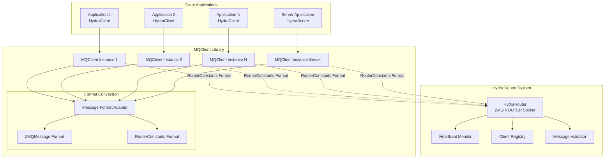
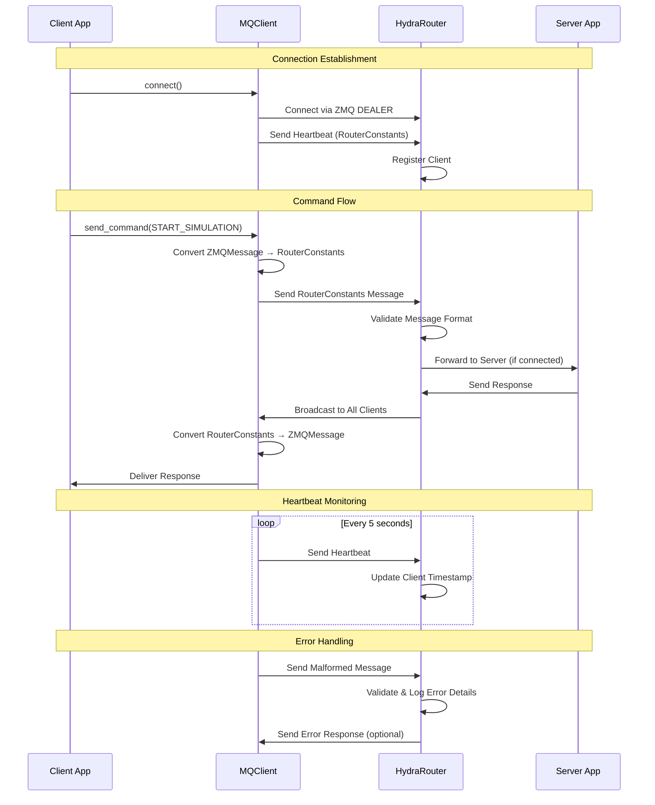

# Design Document: Hydra Router

## Overview

The Hydra Router is a reusable ZeroMQ-based message routing system that will be part of the AI Hydra PyPI package. It extracts and enhances the existing router functionality from the AI Hydra project, making it available as a standalone component that can be used by any project. The system provides reliable communication between multiple clients and a single server through a centralized router pattern.

**Key Design Features:**
- **Part of AI Hydra Package**: Integrated into the existing ai-hydra PyPI package with `ai-hydra-router` command
- **Reusable Component**: Generic router system that can be used by any project needing message routing
- **Leverages Existing Design**: Built upon the proven HydraRouter, MQClient, and RouterConstants from AI Hydra
- **Message Format Conversion**: Automatic conversion between internal ZMQMessage and RouterConstants formats
- **Single Server Architecture**: Supports multiple clients with zero or one server (extensible for future multi-server support)
- **Enhanced Error Handling**: Improved validation and error reporting based on router-message-protocol-fix

## Architecture

### High-Level Architecture



### Message Flow Architecture



## Components and Interfaces

### HydraRouter (Central Message Router)

**Responsibilities:**
- Accept connections from multiple clients and zero or one server
- Route messages between clients and server based on sender type
- Monitor client health through heartbeat tracking
- Validate message formats and provide detailed error logging
- Handle graceful client disconnection and cleanup

**Key Methods:**
```python
class HydraRouter:
    def __init__(self, router_address: str = "0.0.0.0", router_port: int = 5556, log_level: str = "INFO")
    async def start_background_tasks(self) -> None
    async def handle_requests(self) -> None
    async def forward_to_server(self, elem: str, data: Any, sender: bytes) -> None
    async def broadcast_to_clients(self, elem: str, data: Any, sender_id: str) -> None
    async def prune_dead_clients(self) -> None
    async def shutdown(self) -> None
    
    # Message validation and error handling
    def _validate_message_format(self, message: Dict[str, Any]) -> Tuple[bool, str]
    def _log_malformed_message(self, message: Dict[str, Any], error: str, client_identity: str) -> None
    def _log_frame_error(self, frames: List[bytes], client_identity: str) -> None
    def _log_json_parse_error(self, msg_bytes: bytes, error: Exception, client_identity: str) -> None
```

**Connection Management:**
- Uses ZeroMQ ROUTER socket for handling multiple client connections
- Maintains client registry with connection timestamps
- Supports zero or one server connection
- Automatic client pruning based on heartbeat timeouts

**Message Routing Logic:**
```python
# Client commands → Server
if sender_type == RouterConstants.HYDRA_CLIENT:
    await self.forward_to_server(elem=elem, data=data, sender=identity)

# Server responses → All Clients  
elif sender_type == RouterConstants.HYDRA_SERVER:
    await self.broadcast_to_clients(elem=elem, data=data, sender_id=identity_str)
```

### MQClient (Generic Client Library)

**Responsibilities:**
- Provide unified interface for both client and server applications
- Handle automatic message format conversion between ZMQMessage and RouterConstants
- Manage connection lifecycle including heartbeat sending
- Support both synchronous and asynchronous communication patterns
- Provide comprehensive error handling and validation

**Key Methods:**
```python
class MQClient:
    def __init__(self, router_address: str, client_type: str, heartbeat_interval: float, client_id: Optional[str])
    async def connect(self) -> bool
    async def disconnect(self) -> None
    async def send_message(self, message: ZMQMessage) -> None
    async def receive_message(self) -> Optional[Dict[str, Any]]
    async def send_command(self, message_type: MessageType, data: Dict[str, Any], timeout: float) -> Optional[Dict[str, Any]]
    
    # Format conversion methods
    def _convert_to_router_format(self, message: ZMQMessage) -> Dict[str, Any]
    def _convert_from_router_format(self, router_message: Dict[str, Any]) -> ZMQMessage
    def _map_message_type_to_elem(self, message_type: str) -> str
    def _map_elem_to_message_type(self, elem: str) -> MessageType
    def _validate_router_message(self, message: Dict[str, Any]) -> Tuple[bool, Optional[str]]
    
    # Heartbeat management
    async def _send_heartbeat(self) -> None
```

**Client Type Configuration:**
```python
# Example usage for different client types
hydra_client = MQClient(
    router_address="tcp://localhost:5556",
    client_type="HydraClient",
    client_id="client-001"
)

hydra_server = MQClient(
    router_address="tcp://localhost:5556", 
    client_type="HydraServer",
    client_id="server-001"
)

custom_client = MQClient(
    router_address="tcp://localhost:5556",
    client_type="CustomApp",
    client_id="custom-001"
)
```

### RouterConstants (Message Format Definitions)

**Responsibilities:**
- Define standardized message format constants
- Provide client/server type definitions
- Define message structure keys and system messages
- Centralize network configuration constants

**Key Constants:**
```python
class RouterConstants:
    # Client/Server Types
    HYDRA_CLIENT = "HydraClient"
    HYDRA_SERVER = "HydraServer" 
    HYDRA_ROUTER = "HydraRouter"
    
    # Message Structure Keys
    SENDER = "sender"
    ELEM = "elem"
    DATA = "data"
    CLIENT_ID = "client_id"
    TIMESTAMP = "timestamp"
    REQUEST_ID = "request_id"
    
    # System Messages
    HEARTBEAT = "heartbeat"
    STATUS = "status"
    ERROR = "error"
    
    # Simulation Control Commands
    START_SIMULATION = "start_simulation"
    STOP_SIMULATION = "stop_simulation"
    # ... additional message types
    
    # Configuration
    HEARTBEAT_INTERVAL = 5  # seconds
    DEFAULT_ROUTER_PORT = 5556
```

## Data Models

### Message Format Specifications

#### RouterConstants Format (External Communication)
```python
{
    "sender": str,          # Client type (HydraClient, HydraServer, CustomApp)
    "elem": str,            # Message type (heartbeat, start_simulation, etc.)
    "data": dict,           # Message payload
    "client_id": str,       # Unique client identifier
    "timestamp": float,     # Message timestamp
    "request_id": str       # Optional request correlation ID
}
```

#### ZMQMessage Format (Internal Application Use)
```python
@dataclass
class ZMQMessage:
    message_type: MessageType    # Enum value for message type
    timestamp: float            # Message timestamp
    client_id: Optional[str]    # Client identifier
    request_id: Optional[str]   # Request correlation ID
    data: Optional[Dict[str, Any]]  # Message payload
```

### Message Type Mapping

The MQClient handles automatic conversion between formats:

```python
MESSAGE_TYPE_MAPPING = {
    MessageType.HEARTBEAT.value: RouterConstants.HEARTBEAT,
    MessageType.START_SIMULATION.value: RouterConstants.START_SIMULATION,
    MessageType.STOP_SIMULATION.value: RouterConstants.STOP_SIMULATION,
    MessageType.STATUS_UPDATE.value: RouterConstants.STATUS_UPDATE,
    MessageType.ERROR_OCCURRED.value: RouterConstants.ERROR,
    # ... additional mappings
}
```

### Client Registry Data Model

```python
# Client tracking in HydraRouter
clients: Dict[str, Tuple[str, float]] = {}
# client_id -> (client_type, last_heartbeat_timestamp)

# Example:
{
    "HydraClient-1234": ("HydraClient", 1640995200.0),
    "HydraServer-5678": ("HydraServer", 1640995205.0),
    "CustomApp-9999": ("CustomApp", 1640995210.0)
}
```

## Error Handling and Validation

### Message Validation Pipeline

```python
def _validate_message_format(self, message: Dict[str, Any]) -> Tuple[bool, str]:
    """Comprehensive message validation with detailed error reporting."""
    
    # 1. Type validation
    if not isinstance(message, dict):
        return False, f"Message must be dictionary, got {type(message).__name__}"
    
    # 2. Required field validation
    required_fields = [RouterConstants.SENDER, RouterConstants.ELEM]
    missing_fields = [field for field in required_fields if field not in message]
    if missing_fields:
        return False, f"Missing required fields: {', '.join(missing_fields)}"
    
    # 3. Field type and value validation
    sender = message.get(RouterConstants.SENDER)
    if not isinstance(sender, str) or not sender.strip():
        return False, f"Field 'sender' must be non-empty string, got: {repr(sender)}"
    
    # 4. Sender type validation
    valid_senders = [RouterConstants.HYDRA_CLIENT, RouterConstants.HYDRA_SERVER, RouterConstants.HYDRA_ROUTER]
    if sender not in valid_senders:
        return False, f"Invalid sender type '{sender}', expected: {', '.join(valid_senders)}"
    
    return True, ""
```

### Comprehensive Error Logging

```python
def _log_malformed_message(self, message: Dict[str, Any], error: str, client_identity: str) -> None:
    """Detailed error logging for troubleshooting."""
    
    # Log main error
    self.logger.error(f"Malformed message from client {client_identity}: {error}")
    
    # Log expected vs actual format
    expected_format = {
        RouterConstants.SENDER: "string (HydraClient|HydraServer|CustomApp)",
        RouterConstants.ELEM: "string (message type)",
        RouterConstants.DATA: "dict (optional)"
    }
    self.logger.error(f"Expected format: {expected_format}")
    
    # Log actual message (truncated for safety)
    actual_message = str(message)[:500]
    self.logger.error(f"Actual message: {actual_message}")
    
    # Provide debugging hints
    if RouterConstants.MESSAGE_TYPE in message and RouterConstants.ELEM not in message:
        self.logger.error("Detected ZMQMessage format instead of RouterConstants format")
    
    self.logger.error("Debugging hints: Check MQClient format conversion is working correctly")
```

### Error Recovery Mechanisms

```python
# In MQClient - graceful error handling
async def send_message(self, message: ZMQMessage) -> None:
    try:
        router_message = self._convert_to_router_format(message)
        await self.socket.send_json(router_message)
    except ValueError as e:
        self.logger.error(f"Format conversion failed: {e}")
        raise
    except Exception as e:
        self.logger.error(f"Unexpected error: {e}")
        raise ConnectionError(f"Failed to send message: {e}")

# In HydraRouter - continue processing despite errors
async def handle_requests(self) -> None:
    while True:
        try:
            # Process message
            pass
        except Exception as e:
            self.logger.error(f"Router error: {e}")
            continue  # Continue processing other messages
```

## Deployment and Configuration

### Router Configuration

```python
# Command-line interface
python -m hydra_router.main --address 0.0.0.0 --port 5556 --log-level INFO

# Programmatic configuration
router = HydraRouter(
    router_address="0.0.0.0",
    router_port=5556,
    log_level="INFO"
)
```

### Client Configuration

```python
# Basic client setup
client = MQClient(
    router_address="tcp://localhost:5556",
    client_type="HydraClient",
    heartbeat_interval=5.0,
    client_id="my-client-001"
)

# Server setup
server = MQClient(
    router_address="tcp://localhost:5556",
    client_type="HydraServer", 
    heartbeat_interval=5.0,
    client_id="my-server-001"
)
```

### Network Topology

```
┌─────────────────┐    ┌─────────────────┐    ┌─────────────────┐
│   Client App 1  │    │   Client App 2  │    │   Client App N  │
│   (HydraClient) │    │   (HydraClient) │    │   (CustomApp)   │
└─────────┬───────┘    └─────────┬───────┘    └─────────┬───────┘
          │                      │                      │
          │ MQClient             │ MQClient             │ MQClient
          │                      │                      │
          └──────────────────────┼──────────────────────┘
                                 │
                    ┌────────────┴────────────┐
                    │     Hydra Router        │
                    │   (ZMQ ROUTER Socket)   │
                    │     Port 5556           │
                    └────────────┬────────────┘
                                 │
                    ┌────────────┴────────────┐
                    │    Server App           │
                    │   (HydraServer)         │
                    │     MQClient            │
                    └─────────────────────────┘
```

## Testing Strategy

### Unit Tests
- Test message format conversion functions in MQClient
- Test validation logic for RouterConstants format
- Test error handling for malformed messages
- Test client registry management in HydraRouter

### Property-Based Tests
- Generate random ZMQMessages and test round-trip conversion
- Generate random RouterConstants messages and test validation
- Test heartbeat message processing with various client types
- Test error handling with malformed messages

### Integration Tests
- Test complete message flow between MQClient and HydraRouter
- Test multiple client connections and message broadcasting
- Test server connection/disconnection scenarios
- Test heartbeat monitoring and client pruning

### Performance Tests
- Test router performance with many concurrent clients
- Measure message conversion overhead
- Test memory usage under sustained load
- Validate heartbeat processing efficiency

## Future Extensibility

### Multi-Server Support

The current design supports zero or one server but is architected for future multi-server support:

```python
# Future routing logic for multiple servers
if sender_type == RouterConstants.HYDRA_CLIENT:
    # Route to specific server based on load balancing or message content
    target_server = self._select_target_server(elem, data)
    await self._forward_to_specific_server(target_server, elem, data, sender)

# Server-to-server communication
elif sender_type == RouterConstants.HYDRA_SERVER:
    if self._is_server_to_server_message(elem):
        await self._route_between_servers(elem, data, sender_id)
    else:
        await self.broadcast_to_clients(elem, data, sender_id)
```

### Custom Client Types

The MQClient is designed to support any client type:

```python
# Example custom client types
monitoring_client = MQClient(client_type="MonitoringAgent")
analytics_client = MQClient(client_type="AnalyticsEngine") 
backup_client = MQClient(client_type="BackupService")
```

### Message Protocol Extensions

New message types can be easily added:

```python
# In RouterConstants
NEW_COMMAND = "new_command"
CUSTOM_STATUS = "custom_status"

# In MQClient MESSAGE_TYPE_MAPPING
MessageType.NEW_COMMAND.value: RouterConstants.NEW_COMMAND,
MessageType.CUSTOM_STATUS.value: RouterConstants.CUSTOM_STATUS,
```

This design provides a solid foundation for the current single-server architecture while maintaining extensibility for future enhancements.