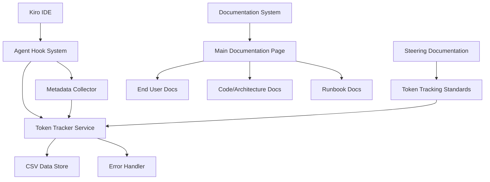

# Design Document

## Overview

The Kiro Token Transaction Tracking System is a comprehensive solution for monitoring AI token usage within the Kiro IDE environment. The system consists of three main components: a token tracking service, an agent hook integration layer, and a documentation restructuring initiative. The design emphasizes reliability, performance, and seamless integration with existing Kiro IDE workflows.

## Architecture

### System Components



### Component Responsibilities

1. **Agent Hook System**: Intercepts Kiro IDE events and triggers token tracking
2. **Token Tracker Service**: Core service that processes and stores token usage data
3. **CSV Data Store**: Persistent storage for transaction history
4. **Metadata Collector**: Gathers contextual information from Kiro IDE environment
5. **Error Handler**: Manages failures and ensures system reliability
6. **Documentation System**: Reorganized documentation structure with clear categorization

## Components and Interfaces

### Token Tracker Service

```python
class TokenTracker:
    """Core service for tracking token transactions."""
    
    def __init__(self, csv_file_path: str, config: TrackerConfig):
        self.csv_file_path = csv_file_path
        self.config = config
        self.error_handler = ErrorHandler()
        self.csv_writer = CSVWriter(csv_file_path)
    
    def record_transaction(self, transaction: TokenTransaction) -> bool:
        """Record a token transaction with full metadata."""
        pass
    
    def get_transaction_history(self, filters: Optional[Dict] = None) -> List[TokenTransaction]:
        """Retrieve transaction history with optional filtering."""
        pass
    
    def validate_csv_integrity(self) -> ValidationResult:
        """Validate CSV file integrity and structure."""
        pass
```

### Agent Hook Integration

```python
class TokenTrackingHook:
    """Agent hook for automatic token tracking."""
    
    def __init__(self, tracker: TokenTracker, metadata_collector: MetadataCollector):
        self.tracker = tracker
        self.metadata_collector = metadata_collector
    
    def on_agent_execution_start(self, context: ExecutionContext) -> None:
        """Triggered when agent execution begins."""
        pass
    
    def on_agent_execution_complete(self, context: ExecutionContext, result: ExecutionResult) -> None:
        """Triggered when agent execution completes."""
        pass
    
    def extract_token_usage(self, result: ExecutionResult) -> TokenUsageData:
        """Extract token usage information from execution result."""
        pass
```

### Metadata Collection

```python
class MetadataCollector:
    """Collects contextual metadata from Kiro IDE environment."""
    
    def collect_execution_metadata(self, context: ExecutionContext) -> ExecutionMetadata:
        """Collect metadata about the current execution context."""
        pass
    
    def get_workspace_info(self) -> WorkspaceInfo:
        """Get current workspace information."""
        pass
    
    def get_hook_context(self) -> HookContext:
        """Get information about the triggering hook."""
        pass
```

## Data Models

### Token Transaction Model

```python
@dataclass
class TokenTransaction:
    """Represents a single token transaction record."""
    timestamp: datetime
    prompt_text: str
    tokens_used: int
    elapsed_time: float
    session_id: str
    workspace_folder: str
    hook_trigger_type: str
    agent_execution_id: str
    file_patterns: Optional[List[str]]
    hook_name: str
    error_occurred: bool = False
    error_message: Optional[str] = None
```

### CSV Schema

```csv
timestamp,prompt_text,tokens_used,elapsed_time,session_id,workspace_folder,hook_trigger_type,agent_execution_id,file_patterns,hook_name,error_occurred,error_message
2024-01-15T10:30:45.123Z,"Implement token tracking system",1250,2.34,sess_abc123,ai_hydra,agentExecutionCompleted,exec_def456,"*.py;*.md",token-tracker-hook,false,
```

### Configuration Model

```python
@dataclass
class TrackerConfig:
    """Configuration for token tracking system."""
    enabled: bool = True
    csv_file_path: str = ".kiro/token_transactions.csv"
    max_prompt_length: int = 1000
    backup_enabled: bool = True
    backup_interval_hours: int = 24
    compression_enabled: bool = False
    retention_days: int = 365
```

## Documentation Architecture

### New Documentation Structure

```
docs/
├── _source/
│   ├── index.rst                    # Main documentation page
│   ├── end_user/                    # End user documentation
│   │   ├── getting_started.rst
│   │   ├── quickstart.rst
│   │   └── troubleshooting.rst
│   ├── architecture/                # Code and architecture docs
│   │   ├── api_reference.rst
│   │   ├── architecture.rst
│   │   ├── decision_flow.rst
│   │   └── design.rst
│   └── runbook/                     # Operational runbook
│       ├── token_tracking.rst
│       ├── version_management.rst
│       ├── deployment.rst
│       └── sdlc_procedures.rst
```

### Main Documentation Page Design

```rst
AI Hydra: Hybrid Neural Network + Tree Search System
===================================================

AI Hydra is an advanced Snake game AI that combines neural network predictions 
with tree search validation to achieve superior performance through hybrid 
decision-making and continuous learning.

Quick Links
-----------

📚 **End User Documentation**
   Complete guides for using AI Hydra, from installation to advanced features.
   
   * :doc:`end_user/getting_started` - Installation and setup
   * :doc:`end_user/quickstart` - Run your first simulation
   * :doc:`end_user/troubleshooting` - Common issues and solutions

🏗️ **Architecture & Code Documentation**
   Technical documentation for developers and researchers.
   
   * :doc:`architecture/architecture` - System design overview
   * :doc:`architecture/api_reference` - Complete API documentation
   * :doc:`architecture/decision_flow` - Decision-making algorithms

⚙️ **Operations Runbook**
   Procedures for project management and maintenance using Kiro IDE.
   
   * :doc:`runbook/token_tracking` - Token usage monitoring
   * :doc:`runbook/version_management` - Release procedures
   * :doc:`runbook/sdlc_procedures` - Development lifecycle management
```

## Implementation Strategy

### Phase 1: Core Token Tracking

1. **CSV Infrastructure**
   - Implement thread-safe CSV writer with file locking
   - Create CSV schema validation and migration system
   - Add backup and rotation mechanisms

2. **Token Tracker Service**
   - Build core tracking service with error handling
   - Implement transaction validation and sanitization
   - Add configuration management system

### Phase 2: Agent Hook Integration

1. **Hook Development**
   - Create token tracking hook following Kiro IDE patterns
   - Implement metadata collection from execution context
   - Add hook configuration and enable/disable functionality

2. **Integration Testing**
   - Test hook triggers with various Kiro IDE events
   - Validate metadata collection accuracy
   - Ensure no interference with normal workflows

### Phase 3: Documentation Restructuring

1. **Content Reorganization**
   - Migrate existing documentation to new structure
   - Create new main documentation page
   - Develop runbook documentation

2. **Steering Documentation**
   - Add token tracking standards to steering docs
   - Create troubleshooting guides
   - Document configuration procedures

## Error Handling

### Error Categories

1. **File System Errors**
   - CSV file access failures
   - Disk space limitations
   - Permission issues

2. **Data Validation Errors**
   - Invalid token usage data
   - Malformed metadata
   - CSV parsing failures

3. **Integration Errors**
   - Hook execution failures
   - Metadata collection issues
   - Kiro IDE communication problems

### Error Recovery Strategies

```python
class ErrorHandler:
    """Handles errors in token tracking system."""
    
    def handle_csv_write_error(self, error: Exception, transaction: TokenTransaction) -> bool:
        """Handle CSV write failures with fallback mechanisms."""
        # 1. Try alternative file location
        # 2. Queue transaction for retry
        # 3. Log error for manual intervention
        pass
    
    def handle_metadata_collection_error(self, error: Exception) -> Dict:
        """Handle metadata collection failures with defaults."""
        # Return minimal viable metadata
        pass
    
    def handle_hook_execution_error(self, error: Exception) -> None:
        """Handle hook execution failures gracefully."""
        # Log error but don't interrupt workflow
        pass
```

## Testing Strategy

### Unit Testing

- **CSV Operations**: Test file writing, reading, and validation
- **Data Models**: Test transaction serialization and validation
- **Error Handling**: Test all error scenarios and recovery mechanisms
- **Configuration**: Test configuration loading and validation

### Integration Testing

- **Hook Integration**: Test with actual Kiro IDE hook system
- **Metadata Collection**: Test metadata accuracy across different scenarios
- **End-to-End Workflows**: Test complete token tracking workflows

### Property-Based Testing

The system will include property-based tests to validate correctness properties:

*A property is a characteristic or behavior that should hold true across all valid executions of a system-essentially, a formal statement about what the system should do. Properties serve as the bridge between human-readable specifications and machine-verifiable correctness guarantees.*

## Correctness Properties

Based on the requirements analysis, the following correctness properties must be validated through property-based testing:

### Property 1: CSV Transaction Persistence
*For any* valid token transaction, recording it to the CSV file should result in the transaction being retrievable with all original data intact, and the CSV should maintain proper structure with required headers.
**Validates: Requirements 1.1, 1.2, 1.3, 6.1, 6.2**

### Property 2: Data Append Safety
*For any* sequence of token transactions, appending them to the CSV should preserve all existing data while adding the new transactions in chronological order.
**Validates: Requirements 1.4, 3.4**

### Property 3: Concurrent Access Safety
*For any* set of concurrent token tracking operations, the CSV file should maintain data integrity with no lost transactions or corrupted data.
**Validates: Requirements 1.5, 6.5**

### Property 4: Hook-Tracker Integration
*For any* valid AI agent execution, the agent hook should automatically trigger token tracking and successfully record the transaction with complete metadata.
**Validates: Requirements 2.1, 2.2, 2.3, 8.1, 8.2, 8.3, 8.4, 8.5**

### Property 5: Error Recovery Resilience
*For any* error condition (file system errors, parsing failures, validation errors), the token tracker should handle the error gracefully, log appropriate messages, and continue operation without data loss.
**Validates: Requirements 2.4, 7.1, 7.2, 7.3, 7.4, 7.5**

### Property 6: Configuration State Management
*For any* configuration change (enable/disable tracking), the system should respect the configuration state and behave accordingly without affecting existing data.
**Validates: Requirements 2.5**

### Property 7: Special Character Handling
*For any* prompt text containing special characters, newlines, or Unicode content, the CSV encoding should preserve the text exactly and remain readable by standard tools.
**Validates: Requirements 6.3, 6.4**

### Property 8: Data Validation Integrity
*For any* input data to the token tracker, invalid data should be rejected with meaningful error messages while valid data should be processed correctly.
**Validates: Requirements 7.3, 7.4**

### Property 9: Documentation Structure Consistency
*For any* documentation reorganization operation, the resulting structure should maintain consistent formatting, navigation, and content organization across all categories.
**Validates: Requirements 3.5, 5.5**

## Performance Considerations

### CSV File Management
- **File Locking**: Use file locking mechanisms to prevent concurrent write conflicts
- **Buffered Writing**: Implement buffered writing for better performance with frequent transactions
- **File Rotation**: Implement automatic file rotation when CSV files become too large
- **Compression**: Optional compression for archived transaction files

### Memory Management
- **Streaming Processing**: Process large CSV files using streaming to minimize memory usage
- **Transaction Batching**: Batch multiple transactions for more efficient disk I/O
- **Metadata Caching**: Cache frequently accessed metadata to reduce collection overhead

### Hook Performance
- **Asynchronous Processing**: Process token tracking asynchronously to avoid blocking normal workflows
- **Error Isolation**: Ensure hook errors don't propagate to main Kiro IDE operations
- **Minimal Overhead**: Keep hook execution time minimal to maintain IDE responsiveness

## Security Considerations

### Data Privacy
- **Prompt Sanitization**: Option to sanitize or truncate sensitive information in prompts
- **Access Control**: Ensure CSV files have appropriate file permissions
- **Data Retention**: Implement configurable data retention policies

### Error Information
- **Error Logging**: Ensure error logs don't expose sensitive information
- **Fallback Security**: Maintain security even when fallback mechanisms are active

## Deployment Strategy

### Installation
1. **Hook Registration**: Register the token tracking hook with Kiro IDE
2. **Configuration Setup**: Create default configuration files
3. **CSV Initialization**: Initialize CSV file with proper headers
4. **Documentation Deployment**: Deploy reorganized documentation structure

### Migration
1. **Existing Data**: Preserve any existing token tracking data
2. **Configuration Migration**: Migrate existing configurations to new format
3. **Documentation Migration**: Move existing documentation to new structure
4. **Backup Creation**: Create backups before migration

### Validation
1. **Hook Testing**: Verify hook triggers correctly in target environment
2. **CSV Validation**: Validate CSV file creation and writing
3. **Documentation Testing**: Verify documentation builds and navigation
4. **Integration Testing**: Test complete end-to-end workflows