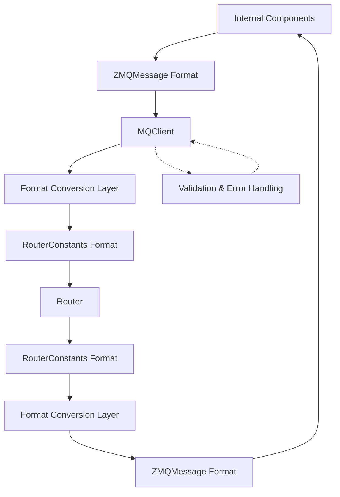

# Design Document

## Implementation Status

**Current Status**: Task 2 (Heartbeat Message Format Fix) is IN PROGRESS

**Completed Tasks**:
- ✅ Task 1: Message format conversion methods implemented in MQClient
- ✅ Task 1.1: Property-based tests for format conversion (Property 1)
- ✅ Task 2.1: Property-based tests for heartbeat processing (Property 3)  
- ✅ Task 3: Message validation and error handling implemented
- ✅ Task 3.1: Property-based tests for format validation (Property 2)
- ✅ Task 3.2: Property-based tests for error handling (Property 4)

**In Progress**:
- 🔄 Task 2: Heartbeat message format fix in MQClient `_send_heartbeat()` method

**Implementation Details**: The MQClient now includes comprehensive message format conversion, validation, and error handling. The heartbeat message format is being updated to use RouterConstants format directly in the `_send_heartbeat()` method.

## Overview

This design addresses the message format mismatch between the AI Hydra router and MQClient components. The router expects RouterConstants format with `elem` field, while MQClient sends ZMQMessage format with `message_type` field. The solution implements a message format adapter that converts between formats while maintaining backward compatibility.

## Architecture

The fix is primarily implemented in the MQClient, which handles format conversion transparently:



**Key Design Principles**:
- MQClient handles all format conversion internally
- Internal components continue using ZMQMessage format unchanged
- Router receives properly formatted RouterConstants messages
- Conversion is transparent to both internal components and router

## Components and Interfaces

### Updated MQClient

**Primary Changes**: MQClient handles all format conversion internally

**Status**: IMPLEMENTATION IN PROGRESS - Task 2 (heartbeat message format fix) is currently being implemented.

**Interface**:
```python
class MQClient:
    async def send_message(self, message: ZMQMessage) -> None:
        """Send message with automatic format conversion to RouterConstants"""
        
    async def receive_message(self) -> Optional[ZMQMessage]:
        """Receive message with automatic format conversion from RouterConstants"""
        
    def _convert_to_router_format(self, message: ZMQMessage) -> Dict[str, Any]:
        """Convert ZMQMessage to RouterConstants format for router communication"""
        
    def _convert_from_router_format(self, router_message: Dict[str, Any]) -> ZMQMessage:
        """Convert RouterConstants format to ZMQMessage for internal use"""
        
    def _validate_router_message(self, message: Dict[str, Any]) -> Tuple[bool, Optional[str]]:
        """Validate RouterConstants format compliance"""
        
    async def _send_heartbeat(self) -> None:
        """Send heartbeat in correct RouterConstants format"""
```

**Key Responsibilities**:
- Convert outgoing ZMQMessages to RouterConstants format
- Convert incoming RouterConstants messages to ZMQMessage format  
- Handle message validation and error reporting
- Maintain backward compatibility for internal components
- **IN PROGRESS**: Implement heartbeat message format fix in `_send_heartbeat()` method

### Router (Minimal Changes)

**Changes**: Only improve error logging and validation messages

**Interface**:
```python
class HydraRouter:
    def _validate_message_format(self, message: Dict[str, Any]) -> Tuple[bool, str]:
        """Enhanced validation with better error messages"""
        
    def _log_malformed_message(self, message: Dict[str, Any], error: str) -> None:
        """Improved logging for malformed messages"""
```

## Data Models

### Message Format Mapping

| ZMQMessage Field | RouterConstants Field | Notes |
|------------------|----------------------|-------|
| `message_type` | `elem` | Direct mapping |
| `client_id` | `client_id` | Preserved |
| `timestamp` | `timestamp` | Preserved |
| `data` | `data` | Preserved |
| N/A | `sender` | Added from client_type |

### RouterConstants Format

```python
{
    "sender": str,      # Client type (HydraServer, HydraClient)
    "elem": str,        # Message type (HEARTBEAT, START_SIMULATION, etc.)
    "data": dict,       # Message payload
    "client_id": str,   # Client identifier
    "timestamp": float, # Message timestamp
    "request_id": str   # Optional request identifier
}
```

### ZMQMessage Format (Internal)

```python
{
    "message_type": str,    # MessageType enum value
    "client_id": str,       # Client identifier
    "timestamp": float,     # Message timestamp
    "request_id": str,      # Optional request identifier
    "data": dict           # Message payload
}
```

## Correctness Properties

*A property is a characteristic or behavior that should hold true across all valid executions of a system-essentially, a formal statement about what the system should do. Properties serve as the bridge between human-readable specifications and machine-verifiable correctness guarantees.*

<function_calls>
<invoke name="prework">
<parameter name="featureName">router-message-protocol-fix

### Property Reflection

After reviewing all the testable properties from the prework analysis, I identified several areas where properties can be consolidated:

- Properties 1.1, 1.2, and 2.1 all test message format compliance and can be combined into a comprehensive format validation property
- Properties 3.1, 3.2, and 3.3 all test conversion correctness and can be combined into a round-trip conversion property
- Properties 2.2, 2.3, and 2.4 all test heartbeat message processing and can be combined into a heartbeat processing property
- Properties 4.1, 4.2, and 4.5 all test error handling and can be combined into an error reporting property

### Converting EARS to Properties

Property 1: Message Format Round-Trip Conversion
*For any* valid ZMQMessage, converting to RouterConstants format and back should preserve all essential message content including type, data, timestamps, and identifiers
**Validates: Requirements 1.3, 3.1, 3.2, 3.3, 3.5**

Property 2: RouterConstants Format Compliance
*For any* message sent by MQClient to the router, the message should have the required RouterConstants format with `sender`, `elem`, `data`, `client_id`, and `timestamp` fields
**Validates: Requirements 1.1, 1.2, 2.1, 2.2**

Property 3: Heartbeat Message Processing
*For any* valid heartbeat message in RouterConstants format, the router should process it without errors and update client tracking information
**Validates: Requirements 2.3, 2.4, 2.5**

Property 4: Format Validation Error Reporting
*For any* invalid message format, the Protocol_Validator should provide specific error details identifying missing or incorrect fields and source component information
**Validates: Requirements 4.1, 4.2, 4.5**

Property 5: Backward Compatibility Preservation
*For any* internal component communication, the ZMQMessage format should remain unchanged and continue to work as before the router format fix
**Validates: Requirements 1.5, 5.1, 5.4**

Property 6: Error Resilience
*For any* format conversion failure or validation error, the system should handle it gracefully without crashing components and provide appropriate retry mechanisms
**Validates: Requirements 4.3, 4.4**

Property 7: Message Type Coverage
*For any* message type (commands, responses, broadcasts, heartbeats), the format conversion should work correctly and preserve message semantics
**Validates: Requirements 3.4**

## Error Handling

### Error Handling in MQClient

**Format Conversion Errors**:
```python
class MQClient:
    def _convert_to_router_format(self, message: ZMQMessage) -> Dict[str, Any]:
        try:
            # Map message_type to elem
            elem = self._map_message_type_to_elem(message.message_type)
            
            router_message = {
                "sender": self.client_type,
                "elem": elem,
                "data": message.data or {},
                "client_id": self.client_id,
                "timestamp": message.timestamp,
                "request_id": message.request_id
            }
            
            # Validate the converted message
            is_valid, error = self._validate_router_message(router_message)
            if not is_valid:
                raise ValueError(f"Converted message validation failed: {error}")
                
            return router_message
            
        except Exception as e:
            self.logger.error(f"Message conversion failed: {e}")
            raise
    
    def _map_message_type_to_elem(self, message_type: MessageType) -> str:
        """Map ZMQMessage types to RouterConstants elements"""
        mapping = {
            MessageType.HEARTBEAT: RouterConstants.HEARTBEAT,
            MessageType.START_SIMULATION: RouterConstants.START_SIMULATION,
            MessageType.STOP_SIMULATION: RouterConstants.STOP_SIMULATION,
            # ... additional mappings
        }
        
        if message_type not in mapping:
            raise ValueError(f"Unsupported message type: {message_type}")
            
        return mapping[message_type]
```

### Router Message Processing

**Error Detection**:
- Validate message structure before processing
- Check for required fields
- Verify field types and values

**Error Response**:
```python
def handle_malformed_message(message: Dict, error: str) -> None:
    logger.error(f"Malformed message: {error}")
    logger.debug(f"Message content: {message}")
    
    # Send error response if possible
    if "client_id" in message:
        error_response = {
            "sender": RouterConstants.HYDRA_ROUTER,
            "elem": RouterConstants.ERROR,
            "data": {"error": error, "original_message": message}
        }
        # Send error response to client
```

## Testing Strategy

### Unit Tests
- Test message format conversion functions
- Test validation logic for both formats
- Test error handling for invalid messages
- Test backward compatibility scenarios

### Property-Based Tests
- Generate random ZMQMessages and test round-trip conversion
- Generate random RouterConstants messages and test validation
- Test heartbeat message processing with various client types
- Test error handling with malformed messages

### Integration Tests
- Test full communication flow between MQClient and Router
- Test heartbeat message exchange without errors
- Test command/response cycles with format conversion
- Test error recovery and retry mechanisms

### Performance Tests
- Measure conversion overhead
- Test with high message volumes
- Verify no memory leaks in conversion process

## Migration Strategy

### Phase 1: Update MQClient Format Conversion
- Implement format conversion methods in MQClient
- Add message type to elem mapping
- Update heartbeat sending to use RouterConstants format
- Add validation and error handling

### Phase 2: Enhance Router Error Reporting  
- Improve router error messages for malformed messages
- Add detailed logging for debugging
- Test with updated MQClient

### Phase 3: Deploy and Verify
- Deploy updated MQClient to resolve heartbeat errors
- Monitor router logs for format issues
- Verify all message types work correctly

### Phase 4: Cleanup and Documentation
- Update code documentation
- Add integration tests
- Remove temporary logging if needed

## Implementation Notes

### Message Type Mapping in MQClient

The MQClient handles the conversion between message formats internally:

```python
class MQClient:
    MESSAGE_TYPE_MAPPING = {
        MessageType.HEARTBEAT.value: RouterConstants.HEARTBEAT,
        MessageType.START_SIMULATION.value: RouterConstants.START_SIMULATION,
        MessageType.STOP_SIMULATION.value: RouterConstants.STOP_SIMULATION,
        MessageType.PAUSE_SIMULATION.value: RouterConstants.PAUSE_SIMULATION,
        MessageType.RESUME_SIMULATION.value: RouterConstants.RESUME_SIMULATION,
        MessageType.GET_STATUS.value: RouterConstants.GET_STATUS,
        # ... additional mappings as needed
    }
```

### Client Type Detection

The router needs to know the client type for proper message routing:

```python
def determine_client_type(message: ZMQMessage) -> str:
    # Logic to determine if this is HydraServer, HydraClient, etc.
    # Based on message content or client configuration
    pass
```

### Logging and Monitoring in MQClient

Add comprehensive logging within MQClient for troubleshooting:

```python
class MQClient:
    def _convert_to_router_format(self, message: ZMQMessage) -> Dict[str, Any]:
        self.logger.debug(f"Converting message: {message.message_type} -> RouterConstants format")
        # ... conversion logic
        self.logger.debug(f"Converted to elem: {router_message['elem']}")
        return router_message
    
    async def _send_heartbeat(self) -> None:
        self.logger.debug(f"Sending heartbeat from {self.client_id} in RouterConstants format")
        # ... heartbeat logic
```