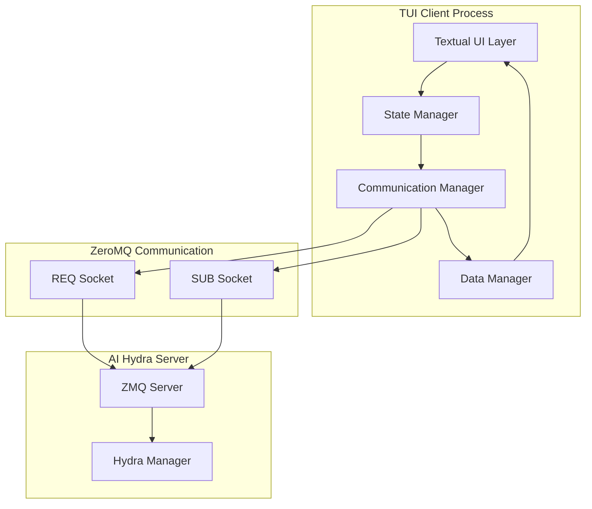

# Design Document

## Overview

The TUI Client is a sophisticated terminal-based user interface built with Textual that provides real-time visualization and control of the AI Hydra Snake Game simulation. The design adapts proven patterns from the existing ai_snake_lab TUI implementation while integrating with the current AI Hydra ZeroMQ protocol.

The client follows a reactive architecture where the UI responds to both user interactions and server-pushed updates. It maintains separation between presentation logic, communication handling, and data management to ensure maintainability and testability.

## Architecture

### High-Level Architecture



### Component Responsibilities

**Textual UI Layer**: Manages all visual components, user interactions, and screen updates using the Textual framework.

**Communication Manager**: Handles all ZeroMQ communication, message serialization/deserialization, and connection management.

**State Manager**: Maintains application state, coordinates between UI and communication layers, and manages reactive updates.

**Data Manager**: Handles data persistence, logging, performance metrics tracking, and historical data management.

## Components and Interfaces

### 1. Main Application (HydraClientApp)

```python
class HydraClientApp(App):
    """Main Textual application for AI Hydra TUI client."""
    
    # Reactive variables for real-time updates
    simulation_state = var("idle")
    game_score = var(0)
    snake_length = var(3)
    moves_count = var(0)
    runtime_seconds = var(0)
    
    # Configuration
    CSS_PATH = "hydra_client.tcss"
    TITLE = "AI Hydra - Snake Game AI Monitor"
    
    def __init__(self, server_address: str = "tcp://localhost:5555"):
        super().__init__()
        self.server_address = server_address
        self.communication_manager = CommunicationManager(server_address)
        self.state_manager = StateManager()
        self.data_manager = DataManager()
        
    async def on_mount(self) -> None:
        """Initialize application on startup."""
        # Connect to server
        # Start background tasks
        # Initialize UI components
        
    def compose(self) -> ComposeResult:
        """Create the main UI layout."""
        # Return all UI components
```

### 2. Game Board Visualization (GameBoardWidget)

```python
class GameBoardWidget(ScrollView):
    """Real-time game board visualization with smooth animations."""
    
    # Reactive properties
    snake_head = var(Offset(0, 0))
    snake_body = var([])
    food_position = var(Offset(5, 5))
    grid_size = var((20, 20))
    
    def __init__(self, board_size: tuple = (20, 20)):
        super().__init__()
        self.board_size = board_size
        self.virtual_size = Size(board_size[0] * 2, board_size[1])
        
    def render_line(self, y: int) -> Strip:
        """Render a single line of the game board."""
        # Implement efficient line-by-line rendering
        # Use color coding for different elements
        
    def update_game_state(self, game_state: GameStateData) -> None:
        """Update board with new game state."""
        # Animate transitions
        # Update reactive properties
        
    def watch_snake_head(self, old_pos: Offset, new_pos: Offset) -> None:
        """React to snake head position changes."""
        # Trigger smooth animation
        # Refresh affected regions
```

### 3. Control Panel (ControlPanelWidget)

```python
class ControlPanelWidget(Vertical):
    """Simulation control interface with configuration options."""
    
    def compose(self) -> ComposeResult:
        yield Horizontal(
            Button("Start", id="btn_start", variant="success"),
            Button("Stop", id="btn_stop", variant="error"),
            Button("Pause", id="btn_pause", variant="warning"),
            Button("Resume", id="btn_resume", variant="primary"),
            Button("Reset", id="btn_reset", variant="default"),
            classes="button_row"
        )
        
        yield Collapsible(
            Vertical(
                Horizontal(
                    Label("Grid Size:", classes="config_label"),
                    Input(value="20,20", id="grid_size", classes="config_input")
                ),
                Horizontal(
                    Label("Move Budget:", classes="config_label"),
                    Input(value="100", id="move_budget", classes="config_input")
                ),
                Horizontal(
                    Label("Random Seed:", classes="config_label"),
                    Input(value="42", id="random_seed", classes="config_input")
                ),
                Horizontal(
                    Label("Neural Network:", classes="config_label"),
                    Checkbox(value=True, id="nn_enabled")
                ),
                classes="config_section"
            ),
            title="Configuration",
            collapsed=True
        )
    
    async def on_button_pressed(self, event: Button.Pressed) -> None:
        """Handle control button presses."""
        # Route to appropriate command handlers
        
    def update_button_states(self, simulation_state: str) -> None:
        """Update button availability based on simulation state."""
        # Enable/disable buttons based on current state
```

### 4. Status Display (StatusDisplayWidget)

```python
class StatusDisplayWidget(Vertical):
    """Real-time status information display."""
    
    def compose(self) -> ComposeResult:
        yield Static("Simulation Status", classes="section_header")
        yield Horizontal(
            Label("State:", classes="status_label"),
            Label("Idle", id="sim_state", classes="status_value")
        )
        yield Horizontal(
            Label("Score:", classes="status_label"),
            Label("0", id="game_score", classes="status_value")
        )
        yield Horizontal(
            Label("Moves:", classes="status_label"),
            Label("0", id="moves_count", classes="status_value")
        )
        yield Horizontal(
            Label("Snake Length:", classes="status_label"),
            Label("3", id="snake_length", classes="status_value")
        )
        yield Horizontal(
            Label("Runtime:", classes="status_label"),
            Label("00:00:00", id="runtime", classes="status_value")
        )
        yield Horizontal(
            Label("High Score:", classes="status_label"),
            Label("0", id="high_score", classes="status_value highlight")
        )
    
    def update_status(self, status_data: dict) -> None:
        """Update all status displays with new data."""
        # Update individual status elements
        # Handle special highlighting for achievements
```

### 5. Performance Monitor (PerformanceWidget)

```python
class PerformanceWidget(Vertical):
    """System performance metrics and trends."""
    
    def compose(self) -> ComposeResult:
        yield Static("Performance Metrics", classes="section_header")
        yield Horizontal(
            Label("Decisions/sec:", classes="perf_label"),
            Label("0.0", id="decisions_per_sec", classes="perf_value")
        )
        yield Horizontal(
            Label("Memory Usage:", classes="perf_label"),
            Label("0 MB", id="memory_usage", classes="perf_value")
        )
        yield Horizontal(
            Label("CPU Usage:", classes="perf_label"),
            Label("0%", id="cpu_usage", classes="perf_value")
        )
        yield Horizontal(
            Label("NN Accuracy:", classes="perf_label"),
            Label("N/A", id="nn_accuracy", classes="perf_value")
        )
        
        # Performance trend visualization
        yield PerformancePlotWidget(id="perf_plot")
    
    def update_performance(self, perf_data: PerformanceMetrics) -> None:
        """Update performance displays and trends."""
        # Update metrics
        # Add data points to trend plot
        # Check for warning thresholds
```

### 6. Communication Manager

```python
class CommunicationManager:
    """Handles all ZeroMQ communication with the AI Hydra server."""
    
    def __init__(self, server_address: str):
        self.server_address = server_address
        self.context = zmq.asyncio.Context()
        self.req_socket = None  # For commands
        self.sub_socket = None  # For status updates
        self.client_id = str(uuid.uuid4())
        self.is_connected = False
        
        # Message handling
        self.message_handlers = {}
        self.request_counter = 0
        
    async def connect(self) -> bool:
        """Establish connection to the server."""
        try:
            # Setup REQ socket for commands
            self.req_socket = self.context.socket(zmq.REQ)
            self.req_socket.connect(self.server_address)
            
            # Setup SUB socket for status updates (if server supports PUB/SUB)
            # For now, use polling with REQ/REP
            
            self.is_connected = True
            return True
        except Exception as e:
            logger.error(f"Connection failed: {e}")
            return False
    
    async def send_command(self, message_type: MessageType, data: dict = None) -> ZMQMessage:
        """Send a command and wait for response."""
        if not self.is_connected:
            raise ConnectionError("Not connected to server")
            
        message = ZMQMessage.create_command(
            message_type,
            self.client_id,
            self._create_request_id(),
            data or {}
        )
        
        await self.req_socket.send_string(message.to_json())
        
        # Wait for response with timeout
        if await self.req_socket.poll(timeout=10000):
            response_data = await self.req_socket.recv_string()
            return ZMQMessage.from_json(response_data)
        else:
            raise TimeoutError("Server response timeout")
    
    async def start_status_polling(self, callback: callable, interval: float = 1.0):
        """Start periodic status polling."""
        while self.is_connected:
            try:
                response = await self.send_command(MessageType.GET_STATUS)
                if response and response.data:
                    await callback(response.data)
            except Exception as e:
                logger.error(f"Status polling error: {e}")
            
            await asyncio.sleep(interval)
    
    def _create_request_id(self) -> str:
        """Generate unique request ID."""
        self.request_counter += 1
        return f"{self.client_id}_{self.request_counter}"
```

### 7. State Manager

```python
class StateManager:
    """Manages application state and coordinates between components."""
    
    def __init__(self):
        self.current_state = {
            "simulation_state": "idle",
            "game_state": None,
            "performance_metrics": None,
            "server_info": None,
            "configuration": self._default_config()
        }
        
        # Event system for reactive updates
        self.event_handlers = defaultdict(list)
        
    def update_simulation_state(self, new_state: str) -> None:
        """Update simulation state and notify listeners."""
        old_state = self.current_state["simulation_state"]
        self.current_state["simulation_state"] = new_state
        self._emit_event("simulation_state_changed", old_state, new_state)
    
    def update_game_state(self, game_state: GameStateData) -> None:
        """Update game state and notify listeners."""
        self.current_state["game_state"] = game_state
        self._emit_event("game_state_updated", game_state)
    
    def update_performance_metrics(self, metrics: PerformanceMetrics) -> None:
        """Update performance metrics and notify listeners."""
        self.current_state["performance_metrics"] = metrics
        self._emit_event("performance_updated", metrics)
    
    def subscribe(self, event_type: str, handler: callable) -> None:
        """Subscribe to state change events."""
        self.event_handlers[event_type].append(handler)
    
    def _emit_event(self, event_type: str, *args) -> None:
        """Emit event to all subscribers."""
        for handler in self.event_handlers[event_type]:
            try:
                handler(*args)
            except Exception as e:
                logger.error(f"Event handler error: {e}")
    
    def _default_config(self) -> dict:
        """Return default configuration."""
        return {
            "grid_size": (20, 20),
            "move_budget": 100,
            "random_seed": 42,
            "nn_enabled": True,
            "initial_snake_length": 3
        }
```

### 8. Data Manager

```python
class DataManager:
    """Handles data persistence, logging, and historical tracking."""
    
    def __init__(self, data_dir: str = "~/.hydra_client"):
        self.data_dir = Path(data_dir).expanduser()
        self.data_dir.mkdir(exist_ok=True)
        
        # Data storage
        self.game_history = []
        self.performance_history = []
        self.high_scores = []
        
        # Load existing data
        self._load_data()
    
    def log_game_result(self, game_state: GameStateData, final_score: int) -> None:
        """Log completed game result."""
        game_record = {
            "timestamp": datetime.now().isoformat(),
            "final_score": final_score,
            "moves_count": game_state.moves_count,
            "snake_length": len(game_state.snake_body),
            "grid_size": game_state.grid_size
        }
        
        self.game_history.append(game_record)
        
        # Check for high score
        if final_score > self._get_current_high_score():
            self.high_scores.append({
                "score": final_score,
                "timestamp": datetime.now().isoformat(),
                "moves": game_state.moves_count
            })
            self.high_scores.sort(key=lambda x: x["score"], reverse=True)
            self.high_scores = self.high_scores[:10]  # Keep top 10
        
        self._save_data()
    
    def log_performance_metrics(self, metrics: PerformanceMetrics) -> None:
        """Log performance metrics for trend analysis."""
        perf_record = {
            "timestamp": datetime.now().isoformat(),
            "decisions_per_second": metrics.decisions_per_second,
            "memory_usage_mb": metrics.memory_usage_mb,
            "cpu_usage_percent": metrics.cpu_usage_percent,
            "neural_network_accuracy": metrics.neural_network_accuracy
        }
        
        self.performance_history.append(perf_record)
        
        # Keep only recent history (last 1000 records)
        if len(self.performance_history) > 1000:
            self.performance_history = self.performance_history[-1000:]
    
    def get_performance_trends(self, duration_minutes: int = 60) -> list:
        """Get performance trends for the specified duration."""
        cutoff_time = datetime.now() - timedelta(minutes=duration_minutes)
        
        return [
            record for record in self.performance_history
            if datetime.fromisoformat(record["timestamp"]) > cutoff_time
        ]
    
    def export_data(self, export_path: str) -> None:
        """Export all data to JSON file."""
        export_data = {
            "game_history": self.game_history,
            "performance_history": self.performance_history,
            "high_scores": self.high_scores,
            "export_timestamp": datetime.now().isoformat()
        }
        
        with open(export_path, 'w') as f:
            json.dump(export_data, f, indent=2)
    
    def _load_data(self) -> None:
        """Load existing data from disk."""
        try:
            data_file = self.data_dir / "client_data.json"
            if data_file.exists():
                with open(data_file, 'r') as f:
                    data = json.load(f)
                    self.game_history = data.get("game_history", [])
                    self.performance_history = data.get("performance_history", [])
                    self.high_scores = data.get("high_scores", [])
        except Exception as e:
            logger.error(f"Error loading data: {e}")
    
    def _save_data(self) -> None:
        """Save data to disk."""
        try:
            data_file = self.data_dir / "client_data.json"
            data = {
                "game_history": self.game_history,
                "performance_history": self.performance_history,
                "high_scores": self.high_scores
            }
            with open(data_file, 'w') as f:
                json.dump(data, f, indent=2)
        except Exception as e:
            logger.error(f"Error saving data: {e}")
    
    def _get_current_high_score(self) -> int:
        """Get current high score."""
        return max([score["score"] for score in self.high_scores], default=0)
```

## Data Models

### Game State Representation

```python
@dataclass
class ClientGameState:
    """Client-side game state representation."""
    snake_head: tuple[int, int]
    snake_body: list[tuple[int, int]]
    food_position: tuple[int, int]
    score: int
    moves_count: int
    is_game_over: bool
    grid_size: tuple[int, int]
    timestamp: float
    
    @classmethod
    def from_zmq_data(cls, zmq_game_state: dict) -> 'ClientGameState':
        """Create from ZeroMQ game state data."""
        return cls(
            snake_head=tuple(zmq_game_state["snake_head"]),
            snake_body=[tuple(pos) for pos in zmq_game_state["snake_body"]],
            food_position=tuple(zmq_game_state["food_position"]),
            score=zmq_game_state["score"],
            moves_count=zmq_game_state["moves_count"],
            is_game_over=zmq_game_state["is_game_over"],
            grid_size=tuple(zmq_game_state["grid_size"]),
            timestamp=time.time()
        )
```

### Configuration Management

```python
@dataclass
class ClientConfiguration:
    """Client configuration settings."""
    server_address: str = "tcp://localhost:5555"
    status_update_interval: float = 1.0
    auto_reconnect: bool = True
    reconnect_delay: float = 5.0
    
    # UI preferences
    theme: str = "dark"
    animation_speed: float = 1.0
    show_performance_plots: bool = True
    
    # Simulation defaults
    default_grid_size: tuple[int, int] = (20, 20)
    default_move_budget: int = 100
    default_random_seed: int = 42
    
    def save_to_file(self, config_path: str) -> None:
        """Save configuration to file."""
        with open(config_path, 'w') as f:
            json.dump(asdict(self), f, indent=2)
    
    @classmethod
    def load_from_file(cls, config_path: str) -> 'ClientConfiguration':
        """Load configuration from file."""
        try:
            with open(config_path, 'r') as f:
                data = json.load(f)
                return cls(**data)
        except Exception:
            return cls()  # Return defaults if loading fails
```

## Error Handling

### Connection Management

The client implements robust connection handling with automatic reconnection:

```python
class ConnectionManager:
    """Manages ZeroMQ connection with automatic recovery."""
    
    async def maintain_connection(self) -> None:
        """Maintain connection with automatic reconnection."""
        while self.should_maintain_connection:
            if not self.is_connected:
                try:
                    await self.connect()
                    self.connection_attempts = 0
                except Exception as e:
                    self.connection_attempts += 1
                    delay = min(self.base_delay * (2 ** self.connection_attempts), 60)
                    logger.warning(f"Connection failed, retrying in {delay}s: {e}")
                    await asyncio.sleep(delay)
            else:
                # Test connection health
                try:
                    await self.ping_server()
                    await asyncio.sleep(self.health_check_interval)
                except Exception as e:
                    logger.error(f"Connection health check failed: {e}")
                    self.is_connected = False
```

### Error Display and Recovery

```python
class ErrorHandler:
    """Centralized error handling and user notification."""
    
    def __init__(self, app: HydraClientApp):
        self.app = app
        self.error_history = []
    
    async def handle_error(self, error: Exception, context: str, recoverable: bool = True) -> None:
        """Handle errors with appropriate user feedback."""
        error_info = {
            "timestamp": datetime.now().isoformat(),
            "error_type": type(error).__name__,
            "message": str(error),
            "context": context,
            "recoverable": recoverable
        }
        
        self.error_history.append(error_info)
        
        # Show user notification
        if recoverable:
            self.app.notify(
                f"Warning: {error_info['message']}",
                severity="warning",
                timeout=5.0
            )
        else:
            self.app.notify(
                f"Error: {error_info['message']}",
                severity="error",
                timeout=10.0
            )
        
        # Log error
        logger.error(f"Error in {context}: {error}")
        
        # Attempt recovery if possible
        if recoverable:
            await self._attempt_recovery(context, error)
    
    async def _attempt_recovery(self, context: str, error: Exception) -> None:
        """Attempt automatic recovery from errors."""
        if "connection" in context.lower():
            # Trigger reconnection
            await self.app.communication_manager.reconnect()
        elif "timeout" in str(error).lower():
            # Retry with longer timeout
            pass  # Implement retry logic
```

## Testing Strategy

### Unit Testing Approach

The TUI client will use a dual testing approach combining unit tests and property-based tests:

**Unit Tests**: Focus on specific component behaviors, UI interactions, and integration points.

**Property-Based Tests**: Validate universal properties across different input scenarios and state transitions.

### Test Categories

1. **UI Component Tests**: Verify widget rendering, user interactions, and state updates
2. **Communication Tests**: Test ZeroMQ message handling, connection management, and error recovery
3. **State Management Tests**: Validate state transitions, event handling, and data consistency
4. **Integration Tests**: Test end-to-end workflows and component interactions
5. **Performance Tests**: Verify UI responsiveness and resource usage under load

### Mock Strategy

```python
class MockZMQServer:
    """Mock ZeroMQ server for testing."""
    
    def __init__(self):
        self.messages_received = []
        self.responses = {}
        self.simulation_state = "idle"
    
    def set_response(self, message_type: MessageType, response_data: dict) -> None:
        """Set mock response for message type."""
        self.responses[message_type] = response_data
    
    async def handle_message(self, message: ZMQMessage) -> ZMQMessage:
        """Handle mock message and return configured response."""
        self.messages_received.append(message)
        
        response_data = self.responses.get(message.message_type, {})
        return ZMQMessage.create_response(
            MessageType.STATUS_RESPONSE,
            message.request_id,
            response_data
        )
```

## Correctness Properties

*A property is a characteristic or behavior that should hold true across all valid executions of a system-essentially, a formal statement about what the system should do. Properties serve as the bridge between human-readable specifications and machine-verifiable correctness guarantees.*

### Property 1: Game Board Visual Rendering
*For any* valid game state (snake position, food position, grid size), the Game_Board should render distinct visual indicators for snake head, snake body segments, and food position within the specified grid layout.
**Validates: Requirements 1.1, 1.2, 1.5**

### Property 2: Real-Time Display Updates
*For any* game state update, the Game_Board should refresh the display within 100ms and provide smooth animation transitions for snake movement.
**Validates: Requirements 1.3, 1.4**

### Property 3: Control Button Command Generation
*For any* valid control button interaction (start, stop, pause, resume, reset), the TUI_Client should send the corresponding ZMQ command to the server and update the UI state appropriately.
**Validates: Requirements 2.1, 2.2, 2.3, 2.4, 2.5**

### Property 4: Simulation State Button Management
*For any* simulation state (idle, running, paused, stopped), the Control_Panel should enable only valid actions and disable invalid actions based on the current state.
**Validates: Requirements 2.6**

### Property 5: Status Information Display
*For any* simulation status data (score, moves, snake length, runtime), the Status_Display should show the current values and highlight achievements when new high scores are reached.
**Validates: Requirements 3.1, 3.2, 3.3, 3.4, 3.5**

### Property 6: Performance Metrics Visualization
*For any* performance metrics data (decisions/sec, memory usage, CPU usage, NN accuracy), the Performance_Monitor should display the values and maintain rolling history for trend analysis.
**Validates: Requirements 4.1, 4.2, 4.3, 4.4, 4.5**

### Property 7: Performance Threshold Warnings
*For any* performance metrics that exceed defined thresholds, the Performance_Monitor should provide visual warnings to alert users of potential issues.
**Validates: Requirements 4.6**

### Property 8: Configuration Validation and Persistence
*For any* valid configuration values (grid size, move budget, random seed, NN enabled), the TUI_Client should validate the values, allow configuration, and maintain persistence across application restarts.
**Validates: Requirements 5.1, 5.2, 5.3, 5.4, 5.5, 5.6**

### Property 9: ZeroMQ Communication Reliability
*For any* ZMQ communication scenario (connection, disconnection, command sending, status receiving), the TUI_Client should handle the communication reliably with appropriate error handling and automatic reconnection.
**Validates: Requirements 6.1, 6.2, 6.3, 6.4, 6.5**

### Property 10: User Interface Responsiveness
*For any* user interaction (keyboard input, terminal resize, component loading), the TUI_Client should respond within acceptable time limits and provide appropriate visual feedback.
**Validates: Requirements 7.1, 7.2, 7.3, 7.4**

### Property 11: Visual Consistency and Error Display
*For any* UI component or error condition, the TUI_Client should maintain consistent styling and display clear error messages with recovery options when errors occur.
**Validates: Requirements 7.5, 7.6**

### Property 12: Data Logging and Export
*For any* completed game or performance data, the TUI_Client should log the information and support data export with filtering and search capabilities.
**Validates: Requirements 8.1, 8.2, 8.3, 8.4, 8.5**

### Property 13: Data Persistence Round Trip
*For any* application data (game history, performance history, high scores, user preferences), saving then loading should produce equivalent data structures.
**Validates: Requirements 8.6**

### Property 14: Multi-Client State Synchronization
*For any* multi-client scenario, the TUI_Client should display synchronized simulation state, handle concurrent commands gracefully, and show appropriate conflict warnings.
**Validates: Requirements 9.1, 9.2, 9.3, 9.4, 9.5, 9.6**

### Property 15: Accessibility and Navigation Support
*For any* UI component or interaction method (keyboard navigation, screen readers, visual elements), the TUI_Client should provide accessible interfaces with appropriate text descriptions and high-contrast visuals.
**Validates: Requirements 10.1, 10.2, 10.3, 10.4, 10.5, 10.6**

## Error Handling

### Connection Management

The client implements robust connection handling with automatic reconnection:

```python
class ConnectionManager:
    """Manages ZeroMQ connection with automatic recovery."""
    
    async def maintain_connection(self) -> None:
        """Maintain connection with automatic reconnection."""
        while self.should_maintain_connection:
            if not self.is_connected:
                try:
                    await self.connect()
                    self.connection_attempts = 0
                except Exception as e:
                    self.connection_attempts += 1
                    delay = min(self.base_delay * (2 ** self.connection_attempts), 60)
                    logger.warning(f"Connection failed, retrying in {delay}s: {e}")
                    await asyncio.sleep(delay)
            else:
                # Test connection health
                try:
                    await self.ping_server()
                    await asyncio.sleep(self.health_check_interval)
                except Exception as e:
                    logger.error(f"Connection health check failed: {e}")
                    self.is_connected = False
```

### Error Display and Recovery

```python
class ErrorHandler:
    """Centralized error handling and user notification."""
    
    def __init__(self, app: HydraClientApp):
        self.app = app
        self.error_history = []
    
    async def handle_error(self, error: Exception, context: str, recoverable: bool = True) -> None:
        """Handle errors with appropriate user feedback."""
        error_info = {
            "timestamp": datetime.now().isoformat(),
            "error_type": type(error).__name__,
            "message": str(error),
            "context": context,
            "recoverable": recoverable
        }
        
        self.error_history.append(error_info)
        
        # Show user notification
        if recoverable:
            self.app.notify(
                f"Warning: {error_info['message']}",
                severity="warning",
                timeout=5.0
            )
        else:
            self.app.notify(
                f"Error: {error_info['message']}",
                severity="error",
                timeout=10.0
            )
        
        # Log error
        logger.error(f"Error in {context}: {error}")
        
        # Attempt recovery if possible
        if recoverable:
            await self._attempt_recovery(context, error)
    
    async def _attempt_recovery(self, context: str, error: Exception) -> None:
        """Attempt automatic recovery from errors."""
        if "connection" in context.lower():
            # Trigger reconnection
            await self.app.communication_manager.reconnect()
        elif "timeout" in str(error).lower():
            # Retry with longer timeout
            pass  # Implement retry logic
```

## Testing Strategy

### Dual Testing Approach

The TUI client uses both unit tests and property-based tests as complementary approaches:

- **Unit Tests**: Validate specific examples, edge cases, and error conditions
- **Property-Based Tests**: Validate universal properties across all inputs
- **Integration Tests**: Validate component interactions and end-to-end flows
- **UI Tests**: Validate user interface behavior and visual consistency

### Property-Based Testing Configuration

Property-based tests will use Hypothesis with the following configuration:
- Minimum 100 iterations per property test
- Each property test references its design document property
- Tag format: **Feature: tui-client, Property {number}: {property_text}**

### Test Categories

1. **UI Component Tests**: Verify widget rendering, user interactions, and state updates
2. **Communication Tests**: Test ZeroMQ message handling, connection management, and error recovery
3. **State Management Tests**: Validate state transitions, event handling, and data consistency
4. **Integration Tests**: Test end-to-end workflows and component interactions
5. **Performance Tests**: Verify UI responsiveness and resource usage under load

### Mock Strategy

```python
class MockZMQServer:
    """Mock ZeroMQ server for testing."""
    
    def __init__(self):
        self.messages_received = []
        self.responses = {}
        self.simulation_state = "idle"
    
    def set_response(self, message_type: MessageType, response_data: dict) -> None:
        """Set mock response for message type."""
        self.responses[message_type] = response_data
    
    async def handle_message(self, message: ZMQMessage) -> ZMQMessage:
        """Handle mock message and return configured response."""
        self.messages_received.append(message)
        
        response_data = self.responses.get(message.message_type, {})
        return ZMQMessage.create_response(
            MessageType.STATUS_RESPONSE,
            message.request_id,
            response_data
        )
```

### Testing Framework Integration

The testing strategy integrates with pytest and uses:
- **pytest-asyncio**: For testing async components
- **pytest-textual**: For testing Textual UI components
- **hypothesis**: For property-based testing
- **pytest-mock**: For mocking ZeroMQ communication
- **pytest-timeout**: For preventing test hangs

### Performance Testing

UI performance tests will validate:
- Startup time under 2 seconds
- Display refresh within 100ms
- Keyboard response immediacy
- Memory usage stability during long runs
- CPU usage efficiency during updates

This design provides a comprehensive foundation for building a robust, user-friendly TUI client that effectively visualizes and controls the AI Hydra simulation system while maintaining the proven architectural patterns from your existing implementation.